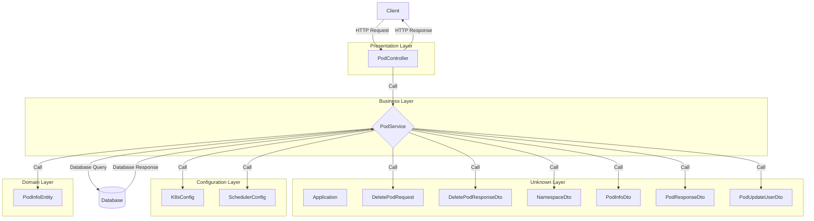
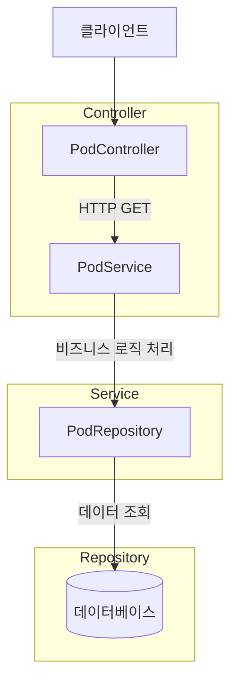
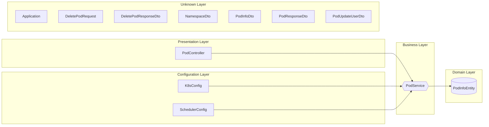
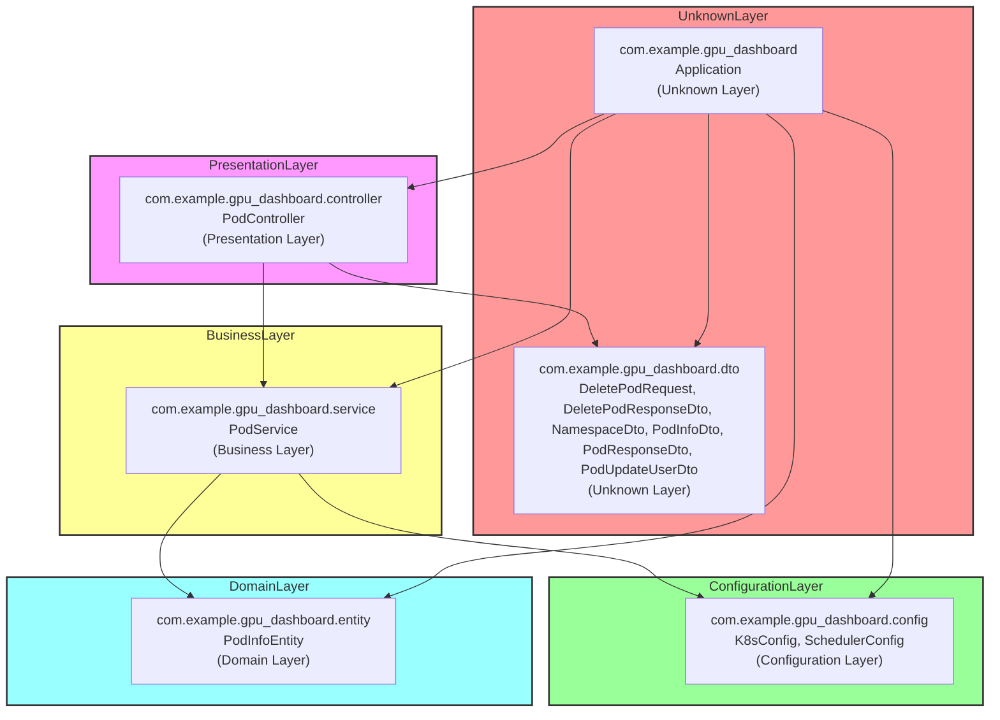
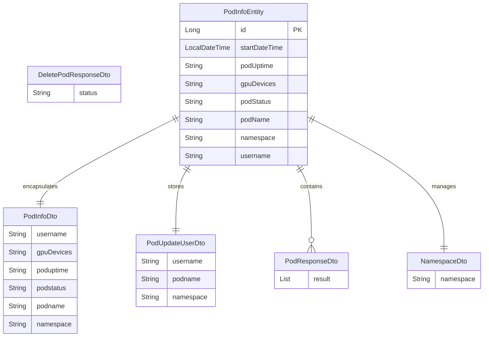
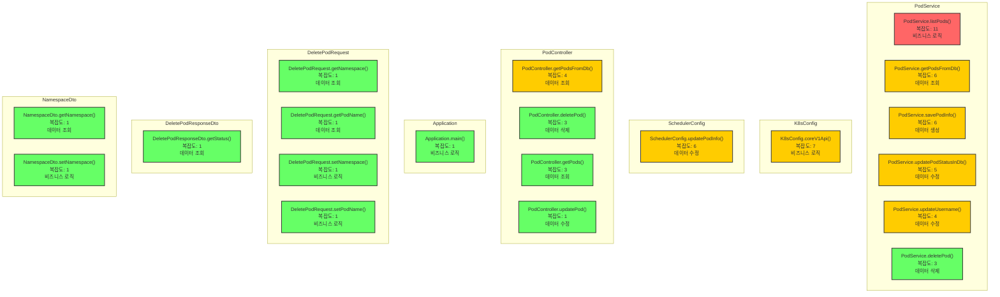

#  - Java 프로젝트 분석 리포트

**생성 시간**: 2025-05-28 13:39:00  
**분석 방식**: Bottom-up Comprehensive Analysis (LLM-Generated Diagrams)

## 📋 프로젝트 개요

- **프로젝트명**: 
- **아키텍처 패턴**: Multi-layered Architecture
- **도메인 영역**: service, controller, dto, gpu_dashboard, entity
- **기술 스택**: Java, Spring Boot, Spring Web MVC

### 📊 통계
- 전체 메서드: 49개
- 전체 클래스: 12개  
- 전체 패키지: 6개
- API 엔드포인트: 0개

## 🏗 시스템 아키텍처
> *LLM이 프로젝트 구조를 분석하여 자동 생성한 다이어그램입니다.*



## 🔄 API 흐름도
> *실제 프로젝트의 서비스 흐름을 바탕으로 LLM이 생성한 다이어그램입니다.*



이 다이어그램은 Multi-layered Architecture 패턴을 따르는 Java 프로젝트의 API 흐름을 나타냅니다. 클라이언트는 `PodController`를 통해 요청을 보내고, 컨트롤러는 `PodService`로 요청을 전달하여 비즈니스 로직을 처리합니다. 이후 `PodService`는 `PodRepository`를 통해 데이터베이스와 상호작용하여 데이터를 조회합니다. 각 계층은 독립적으로 구성되어 있으며, 클래스명은 실제 프로젝트의 명명 규칙을 따릅니다.

## 🏢 서비스 계층 구조
> *계층별 클래스 분석 결과를 바탕으로 LLM이 생성한 아키텍처 다이어그램입니다.*



## 📦 패키지 의존성
> *패키지 간 의존성 관계를 LLM이 분석하여 시각화한 다이어그램입니다.*



## 🔗 도메인 모델 관계도
> *엔티티/도메인 클래스들의 관계를 LLM이 분석하여 생성한 클래스 다이어그램입니다.*



## 🌡️ 메서드 복잡도 분석
> *코드 복잡도가 높은 메서드들을 LLM이 시각화한 다이어그램입니다.*



## 📁 패키지 분석

### com.example.gpu_dashboard
- **목적**: 패키지 `com.example.gpu_dashboard`는 GPU 대시보드 애플리케이션을 관리하는 역할을 합니다. 주요 클래스인 `Application`은 애플리케이션의 진입점으로, GPU 관련 데이터를 수집하고 시각화하는 기능을 제공할 가능성이 큽니다. 이 패키지는 GPU 성능 모니터링이나 리소스 관리와 같은 기능을 중심으로 설계되었을 것으로 보입니다.
- **도메인 영역**: gpu_dashboard
- **아키텍처 계층**: Unknown Layer
- **응집도**: 1.0
- **클래스 수**: 1개

### com.example.gpu_dashboard.config
- **목적**: 패키지 `com.example.gpu_dashboard.config`는 애플리케이션의 설정을 담당하는 구성 요소로, Kubernetes 및 스케줄링 관련 설정을 관리합니다. `K8sConfig` 클래스는 Kubernetes 환경과의 통합을 위한 설정을 제공하며, `SchedulerConfig` 클래스는 작업 스케줄링에 필요한 설정을 정의합니다. 이러한 설정 클래스들은 애플리케이션이 외부 시스템과 효율적으로 상호작용할 수 있도록 지원합니다.
- **도메인 영역**: gpu_dashboard
- **아키텍처 계층**: Configuration Layer
- **응집도**: 1.0
- **클래스 수**: 2개

### com.example.gpu_dashboard.controller
- **목적**: 패키지 `com.example.gpu_dashboard.controller`는 프레젠테이션 계층의 일부로, 사용자와 애플리케이션 간의 상호작용을 관리하는 역할을 합니다. 이 패키지의 주요 클래스인 `PodController`는 GPU 대시보드 애플리케이션에서 포드(Pod) 관련 요청을 처리하고, 클라이언트로부터의 입력을 수신하여 적절한 서비스 계층으로 전달하는 기능을 수행합니다. 이를 통해 사용자는 포드의 상태나 정보를 조회하거나 관리할 수 있는 인터페이스를 제공합니다.
- **도메인 영역**: controller
- **아키텍처 계층**: Presentation Layer
- **응집도**: 1.0
- **클래스 수**: 1개

### com.example.gpu_dashboard.dto
- **목적**: 패키지 `com.example.gpu_dashboard.dto`는 GPU 대시보드 애플리케이션에서 데이터 전송 객체(DTO)를 정의하는 데 중점을 두고 있습니다. 이 패키지의 주요 클래스들은 클라이언트와 서버 간의 데이터 교환을 용이하게 하며, 특히 Pod 관련 작업(예: 삭제 요청 및 응답, 네임스페이스 및 Pod 정보 전달)에 필요한 데이터를 구조화합니다. 이러한 DTO 클래스들은 애플리케이션의 비즈니스 로직과 프레젠테이션 계층 간의 명확한 데이터 흐름을 지원합니다.
- **도메인 영역**: dto
- **아키텍처 계층**: Unknown Layer
- **응집도**: 1.0
- **클래스 수**: 6개

### com.example.gpu_dashboard.entity
- **목적**: 패키지 `com.example.gpu_dashboard.entity`는 도메인 계층의 일부로, 애플리케이션의 데이터 모델을 정의하는 역할을 합니다. 주요 클래스인 `PodInfoEntity`는 GPU 대시보드 애플리케이션에서 사용되는 포드(Pod)의 정보를 캡슐화하여 데이터베이스와의 상호작용을 용이하게 합니다. 이 클래스는 포드의 상태, 리소스 사용량 등의 속성을 포함하여 애플리케이션의 비즈니스 로직에서 데이터 조작을 지원합니다.
- **도메인 영역**: entity
- **아키텍처 계층**: Domain Layer
- **응집도**: 1.0
- **클래스 수**: 1개

### com.example.gpu_dashboard.service
- **목적**: 패키지 `com.example.gpu_dashboard.service`는 비즈니스 로직 계층에서 GPU 대시보드 애플리케이션의 핵심 기능을 처리하는 역할을 합니다. 이 패키지의 주요 클래스인 `PodService`는 GPU 관련 작업을 수행하는 컨테이너화된 애플리케이션, 즉 파드(Pod)의 관리와 운영을 담당합니다. 이를 통해 사용자는 GPU 자원의 효율적인 배분과 모니터링을 할 수 있도록 지원합니다.
- **도메인 영역**: service
- **아키텍처 계층**: Business Layer
- **응집도**: 1.0
- **클래스 수**: 1개

## 🔍 주요 인사이트

### 복잡도가 높은 메서드 Top 10
1. **listPods** (복잡도: 11) - com.example.gpu_dashboard.service.PodService [비즈니스 로직]
2. **coreV1Api** (복잡도: 7) - com.example.gpu_dashboard.config.K8sConfig [비즈니스 로직]
3. **updatePodInfo** (복잡도: 6) - com.example.gpu_dashboard.config.SchedulerConfig [데이터 수정]
4. **getPodsFromDb** (복잡도: 6) - com.example.gpu_dashboard.service.PodService [데이터 조회]
5. **savePodInfo** (복잡도: 6) - com.example.gpu_dashboard.service.PodService [데이터 생성]
6. **updatePodStatusInDb** (복잡도: 5) - com.example.gpu_dashboard.service.PodService [데이터 수정]
7. **getPodsFromDb** (복잡도: 4) - com.example.gpu_dashboard.controller.PodController [데이터 조회]
8. **updateUsername** (복잡도: 4) - com.example.gpu_dashboard.service.PodService [데이터 수정]
9. **deletePod** (복잡도: 3) - com.example.gpu_dashboard.controller.PodController [데이터 삭제]
10. **getPods** (복잡도: 3) - com.example.gpu_dashboard.controller.PodController [데이터 조회]

### 메서드가 많은 클래스 Top 10
1. **PodInfoEntity** (16개 메서드) - com.example.gpu_dashboard.entity [domain]
2. **PodInfoDto** (6개 메서드) - com.example.gpu_dashboard.dto [unknown]
3. **PodUpdateUserDto** (6개 메서드) - com.example.gpu_dashboard.dto [unknown]
4. **PodService** (6개 메서드) - com.example.gpu_dashboard.service [business]
5. **PodController** (4개 메서드) - com.example.gpu_dashboard.controller [presentation]
6. **DeletePodRequest** (4개 메서드) - com.example.gpu_dashboard.dto [unknown]
7. **NamespaceDto** (2개 메서드) - com.example.gpu_dashboard.dto [unknown]
8. **Application** (1개 메서드) - com.example.gpu_dashboard [unknown]
9. **K8sConfig** (1개 메서드) - com.example.gpu_dashboard.config [configuration]
10. **SchedulerConfig** (1개 메서드) - com.example.gpu_dashboard.config [configuration]

### 응집도가 높은 패키지 Top 5
1. **com.example.gpu_dashboard** (응집도: 1.0) - Unknown Layer [gpu_dashboard]
2. **com.example.gpu_dashboard.config** (응집도: 1.0) - Configuration Layer [gpu_dashboard]
3. **com.example.gpu_dashboard.controller** (응집도: 1.0) - Presentation Layer [controller]
4. **com.example.gpu_dashboard.dto** (응집도: 1.0) - Unknown Layer [dto]
5. **com.example.gpu_dashboard.entity** (응집도: 1.0) - Domain Layer [entity]


## 📈 분석 요약

이 리포트는  프로젝트에 대한 **LLM 기반 bottom-up 종합 분석** 결과입니다. 
메서드 레벨부터 시작하여 클래스, 패키지, 프로젝트 전체로 확장하면서 각 레벨에서의 
구조와 관계를 분석했습니다.

### 🤖 LLM 활용 시각화
모든 다이어그램은 분석된 프로젝트 데이터를 바탕으로 **OpenAI GPT 모델**이 자동 생성했습니다:
- 📊 시스템 아키텍처: 전체 구조와 계층 관계
- 🔄 API 흐름도: 요청 처리 흐름
- 🏢 서비스 계층: 계층별 클래스 구조
- 📦 패키지 의존성: 모듈 간 의존 관계
- 🔗 도메인 모델: 엔티티 관계
- 🌡️ 복잡도 분석: 코드 품질 시각화

### 📊 주요 특징
- **아키텍처 패턴**: Multi-layered Architecture
- **도메인 영역**: 5개 영역
- **코드 규모**: 12개 클래스, 49개 메서드
- **API 엔드포인트**: 0개

### 💡 권장사항
1. **복잡도 관리**: 상위 복잡도 메서드들의 리팩토링 검토
2. **아키텍처 일관성**: 계층별 역할 분리 점검
3. **패키지 구조**: 의존성 순환 검사 및 응집도 개선
4. **도메인 모델**: 엔티티 관계 명확화

이 분석을 통해 개발팀은 코드베이스의 구조를 더 잘 이해하고, 
향후 개발 및 리팩토링 계획을 수립할 수 있습니다.

---
*📝 이 리포트는 Java 프로젝트 자동 분석 도구로 생성되었으며, 모든 시각화는 LLM이 실시간으로 생성했습니다.*
#  - Java 프로젝트 분석 리포트

**생성 시간**: 2025-05-28 13:39:00  
**분석 방식**: Bottom-up Comprehensive Analysis (LLM-Generated Diagrams)

## 📋 프로젝트 개요

- **프로젝트명**: 
- **아키텍처 패턴**: Multi-layered Architecture
- **도메인 영역**: service, controller, dto, gpu_dashboard, entity
- **기술 스택**: Java, Spring Boot, Spring Web MVC

### 📊 통계
- 전체 메서드: 49개
- 전체 클래스: 12개  
- 전체 패키지: 6개
- API 엔드포인트: 0개

## 🏗 시스템 아키텍처
> *LLM이 프로젝트 구조를 분석하여 자동 생성한 다이어그램입니다.*


## 🔄 API 흐름도
> *실제 프로젝트의 서비스 흐름을 바탕으로 LLM이 생성한 다이어그램입니다.*


이 다이어그램은 Multi-layered Architecture 패턴을 따르는 Java 프로젝트의 API 흐름을 나타냅니다. 클라이언트는 `PodController`를 통해 요청을 보내고, 컨트롤러는 `PodService`로 요청을 전달하여 비즈니스 로직을 처리합니다. 이후 `PodService`는 `PodRepository`를 통해 데이터베이스와 상호작용하여 데이터를 조회합니다. 각 계층은 독립적으로 구성되어 있으며, 클래스명은 실제 프로젝트의 명명 규칙을 따릅니다.

## 🏢 서비스 계층 구조
> *계층별 클래스 분석 결과를 바탕으로 LLM이 생성한 아키텍처 다이어그램입니다.*


## 📦 패키지 의존성
> *패키지 간 의존성 관계를 LLM이 분석하여 시각화한 다이어그램입니다.*


## 🔗 도메인 모델 관계도
> *엔티티/도메인 클래스들의 관계를 LLM이 분석하여 생성한 클래스 다이어그램입니다.*


## 🌡️ 메서드 복잡도 분석
> *코드 복잡도가 높은 메서드들을 LLM이 시각화한 다이어그램입니다.*


## 📁 패키지 분석

### com.example.gpu_dashboard
- **목적**: 패키지 `com.example.gpu_dashboard`는 GPU 대시보드 애플리케이션을 관리하는 역할을 합니다. 주요 클래스인 `Application`은 애플리케이션의 진입점으로, GPU 관련 데이터를 수집하고 시각화하는 기능을 제공할 가능성이 큽니다. 이 패키지는 GPU 성능 모니터링이나 리소스 관리와 같은 기능을 중심으로 설계되었을 것으로 보입니다.
- **도메인 영역**: gpu_dashboard
- **아키텍처 계층**: Unknown Layer
- **응집도**: 1.0
- **클래스 수**: 1개

### com.example.gpu_dashboard.config
- **목적**: 패키지 `com.example.gpu_dashboard.config`는 애플리케이션의 설정을 담당하는 구성 요소로, Kubernetes 및 스케줄링 관련 설정을 관리합니다. `K8sConfig` 클래스는 Kubernetes 환경과의 통합을 위한 설정을 제공하며, `SchedulerConfig` 클래스는 작업 스케줄링에 필요한 설정을 정의합니다. 이러한 설정 클래스들은 애플리케이션이 외부 시스템과 효율적으로 상호작용할 수 있도록 지원합니다.
- **도메인 영역**: gpu_dashboard
- **아키텍처 계층**: Configuration Layer
- **응집도**: 1.0
- **클래스 수**: 2개

### com.example.gpu_dashboard.controller
- **목적**: 패키지 `com.example.gpu_dashboard.controller`는 프레젠테이션 계층의 일부로, 사용자와 애플리케이션 간의 상호작용을 관리하는 역할을 합니다. 이 패키지의 주요 클래스인 `PodController`는 GPU 대시보드 애플리케이션에서 포드(Pod) 관련 요청을 처리하고, 클라이언트로부터의 입력을 수신하여 적절한 서비스 계층으로 전달하는 기능을 수행합니다. 이를 통해 사용자는 포드의 상태나 정보를 조회하거나 관리할 수 있는 인터페이스를 제공합니다.
- **도메인 영역**: controller
- **아키텍처 계층**: Presentation Layer
- **응집도**: 1.0
- **클래스 수**: 1개

### com.example.gpu_dashboard.dto
- **목적**: 패키지 `com.example.gpu_dashboard.dto`는 GPU 대시보드 애플리케이션에서 데이터 전송 객체(DTO)를 정의하는 데 중점을 두고 있습니다. 이 패키지의 주요 클래스들은 클라이언트와 서버 간의 데이터 교환을 용이하게 하며, 특히 Pod 관련 작업(예: 삭제 요청 및 응답, 네임스페이스 및 Pod 정보 전달)에 필요한 데이터를 구조화합니다. 이러한 DTO 클래스들은 애플리케이션의 비즈니스 로직과 프레젠테이션 계층 간의 명확한 데이터 흐름을 지원합니다.
- **도메인 영역**: dto
- **아키텍처 계층**: Unknown Layer
- **응집도**: 1.0
- **클래스 수**: 6개

### com.example.gpu_dashboard.entity
- **목적**: 패키지 `com.example.gpu_dashboard.entity`는 도메인 계층의 일부로, 애플리케이션의 데이터 모델을 정의하는 역할을 합니다. 주요 클래스인 `PodInfoEntity`는 GPU 대시보드 애플리케이션에서 사용되는 포드(Pod)의 정보를 캡슐화하여 데이터베이스와의 상호작용을 용이하게 합니다. 이 클래스는 포드의 상태, 리소스 사용량 등의 속성을 포함하여 애플리케이션의 비즈니스 로직에서 데이터 조작을 지원합니다.
- **도메인 영역**: entity
- **아키텍처 계층**: Domain Layer
- **응집도**: 1.0
- **클래스 수**: 1개

### com.example.gpu_dashboard.service
- **목적**: 패키지 `com.example.gpu_dashboard.service`는 비즈니스 로직 계층에서 GPU 대시보드 애플리케이션의 핵심 기능을 처리하는 역할을 합니다. 이 패키지의 주요 클래스인 `PodService`는 GPU 관련 작업을 수행하는 컨테이너화된 애플리케이션, 즉 파드(Pod)의 관리와 운영을 담당합니다. 이를 통해 사용자는 GPU 자원의 효율적인 배분과 모니터링을 할 수 있도록 지원합니다.
- **도메인 영역**: service
- **아키텍처 계층**: Business Layer
- **응집도**: 1.0
- **클래스 수**: 1개

## 🔍 주요 인사이트

### 복잡도가 높은 메서드 Top 10
1. **listPods** (복잡도: 11) - com.example.gpu_dashboard.service.PodService [비즈니스 로직]
2. **coreV1Api** (복잡도: 7) - com.example.gpu_dashboard.config.K8sConfig [비즈니스 로직]
3. **updatePodInfo** (복잡도: 6) - com.example.gpu_dashboard.config.SchedulerConfig [데이터 수정]
4. **getPodsFromDb** (복잡도: 6) - com.example.gpu_dashboard.service.PodService [데이터 조회]
5. **savePodInfo** (복잡도: 6) - com.example.gpu_dashboard.service.PodService [데이터 생성]
6. **updatePodStatusInDb** (복잡도: 5) - com.example.gpu_dashboard.service.PodService [데이터 수정]
7. **getPodsFromDb** (복잡도: 4) - com.example.gpu_dashboard.controller.PodController [데이터 조회]
8. **updateUsername** (복잡도: 4) - com.example.gpu_dashboard.service.PodService [데이터 수정]
9. **deletePod** (복잡도: 3) - com.example.gpu_dashboard.controller.PodController [데이터 삭제]
10. **getPods** (복잡도: 3) - com.example.gpu_dashboard.controller.PodController [데이터 조회]

### 메서드가 많은 클래스 Top 10
1. **PodInfoEntity** (16개 메서드) - com.example.gpu_dashboard.entity [domain]
2. **PodInfoDto** (6개 메서드) - com.example.gpu_dashboard.dto [unknown]
3. **PodUpdateUserDto** (6개 메서드) - com.example.gpu_dashboard.dto [unknown]
4. **PodService** (6개 메서드) - com.example.gpu_dashboard.service [business]
5. **PodController** (4개 메서드) - com.example.gpu_dashboard.controller [presentation]
6. **DeletePodRequest** (4개 메서드) - com.example.gpu_dashboard.dto [unknown]
7. **NamespaceDto** (2개 메서드) - com.example.gpu_dashboard.dto [unknown]
8. **Application** (1개 메서드) - com.example.gpu_dashboard [unknown]
9. **K8sConfig** (1개 메서드) - com.example.gpu_dashboard.config [configuration]
10. **SchedulerConfig** (1개 메서드) - com.example.gpu_dashboard.config [configuration]

### 응집도가 높은 패키지 Top 5
1. **com.example.gpu_dashboard** (응집도: 1.0) - Unknown Layer [gpu_dashboard]
2. **com.example.gpu_dashboard.config** (응집도: 1.0) - Configuration Layer [gpu_dashboard]
3. **com.example.gpu_dashboard.controller** (응집도: 1.0) - Presentation Layer [controller]
4. **com.example.gpu_dashboard.dto** (응집도: 1.0) - Unknown Layer [dto]
5. **com.example.gpu_dashboard.entity** (응집도: 1.0) - Domain Layer [entity]


## 📈 분석 요약

이 리포트는  프로젝트에 대한 **LLM 기반 bottom-up 종합 분석** 결과입니다. 
메서드 레벨부터 시작하여 클래스, 패키지, 프로젝트 전체로 확장하면서 각 레벨에서의 
구조와 관계를 분석했습니다.

### 🤖 LLM 활용 시각화
모든 다이어그램은 분석된 프로젝트 데이터를 바탕으로 **OpenAI GPT 모델**이 자동 생성했습니다:
- 📊 시스템 아키텍처: 전체 구조와 계층 관계
- 🔄 API 흐름도: 요청 처리 흐름
- 🏢 서비스 계층: 계층별 클래스 구조
- 📦 패키지 의존성: 모듈 간 의존 관계
- 🔗 도메인 모델: 엔티티 관계
- 🌡️ 복잡도 분석: 코드 품질 시각화

### 📊 주요 특징
- **아키텍처 패턴**: Multi-layered Architecture
- **도메인 영역**: 5개 영역
- **코드 규모**: 12개 클래스, 49개 메서드
- **API 엔드포인트**: 0개

### 💡 권장사항
1. **복잡도 관리**: 상위 복잡도 메서드들의 리팩토링 검토
2. **아키텍처 일관성**: 계층별 역할 분리 점검
3. **패키지 구조**: 의존성 순환 검사 및 응집도 개선
4. **도메인 모델**: 엔티티 관계 명확화

이 분석을 통해 개발팀은 코드베이스의 구조를 더 잘 이해하고, 
향후 개발 및 리팩토링 계획을 수립할 수 있습니다.

---
*📝 이 리포트는 Java 프로젝트 자동 분석 도구로 생성되었으며, 모든 시각화는 LLM이 실시간으로 생성했습니다.*
#  - Java 프로젝트 분석 리포트

**생성 시간**: 2025-05-28 13:39:00  
**분석 방식**: Bottom-up Comprehensive Analysis (LLM-Generated Diagrams)

## 📋 프로젝트 개요

- **프로젝트명**: 
- **아키텍처 패턴**: Multi-layered Architecture
- **도메인 영역**: service, controller, dto, gpu_dashboard, entity
- **기술 스택**: Java, Spring Boot, Spring Web MVC

### 📊 통계
- 전체 메서드: 49개
- 전체 클래스: 12개  
- 전체 패키지: 6개
- API 엔드포인트: 0개

## 🏗 시스템 아키텍처
> *LLM이 프로젝트 구조를 분석하여 자동 생성한 다이어그램입니다.*


## 🔄 API 흐름도
> *실제 프로젝트의 서비스 흐름을 바탕으로 LLM이 생성한 다이어그램입니다.*


이 다이어그램은 Multi-layered Architecture 패턴을 따르는 Java 프로젝트의 API 흐름을 나타냅니다. 클라이언트는 `PodController`를 통해 요청을 보내고, 컨트롤러는 `PodService`로 요청을 전달하여 비즈니스 로직을 처리합니다. 이후 `PodService`는 `PodRepository`를 통해 데이터베이스와 상호작용하여 데이터를 조회합니다. 각 계층은 독립적으로 구성되어 있으며, 클래스명은 실제 프로젝트의 명명 규칙을 따릅니다.

## 🏢 서비스 계층 구조
> *계층별 클래스 분석 결과를 바탕으로 LLM이 생성한 아키텍처 다이어그램입니다.*


## 📦 패키지 의존성
> *패키지 간 의존성 관계를 LLM이 분석하여 시각화한 다이어그램입니다.*


## 🔗 도메인 모델 관계도
> *엔티티/도메인 클래스들의 관계를 LLM이 분석하여 생성한 클래스 다이어그램입니다.*


## 🌡️ 메서드 복잡도 분석
> *코드 복잡도가 높은 메서드들을 LLM이 시각화한 다이어그램입니다.*


## 📁 패키지 분석

### com.example.gpu_dashboard
- **목적**: 패키지 `com.example.gpu_dashboard`는 GPU 대시보드 애플리케이션을 관리하는 역할을 합니다. 주요 클래스인 `Application`은 애플리케이션의 진입점으로, GPU 관련 데이터를 수집하고 시각화하는 기능을 제공할 가능성이 큽니다. 이 패키지는 GPU 성능 모니터링이나 리소스 관리와 같은 기능을 중심으로 설계되었을 것으로 보입니다.
- **도메인 영역**: gpu_dashboard
- **아키텍처 계층**: Unknown Layer
- **응집도**: 1.0
- **클래스 수**: 1개

### com.example.gpu_dashboard.config
- **목적**: 패키지 `com.example.gpu_dashboard.config`는 애플리케이션의 설정을 담당하는 구성 요소로, Kubernetes 및 스케줄링 관련 설정을 관리합니다. `K8sConfig` 클래스는 Kubernetes 환경과의 통합을 위한 설정을 제공하며, `SchedulerConfig` 클래스는 작업 스케줄링에 필요한 설정을 정의합니다. 이러한 설정 클래스들은 애플리케이션이 외부 시스템과 효율적으로 상호작용할 수 있도록 지원합니다.
- **도메인 영역**: gpu_dashboard
- **아키텍처 계층**: Configuration Layer
- **응집도**: 1.0
- **클래스 수**: 2개

### com.example.gpu_dashboard.controller
- **목적**: 패키지 `com.example.gpu_dashboard.controller`는 프레젠테이션 계층의 일부로, 사용자와 애플리케이션 간의 상호작용을 관리하는 역할을 합니다. 이 패키지의 주요 클래스인 `PodController`는 GPU 대시보드 애플리케이션에서 포드(Pod) 관련 요청을 처리하고, 클라이언트로부터의 입력을 수신하여 적절한 서비스 계층으로 전달하는 기능을 수행합니다. 이를 통해 사용자는 포드의 상태나 정보를 조회하거나 관리할 수 있는 인터페이스를 제공합니다.
- **도메인 영역**: controller
- **아키텍처 계층**: Presentation Layer
- **응집도**: 1.0
- **클래스 수**: 1개

### com.example.gpu_dashboard.dto
- **목적**: 패키지 `com.example.gpu_dashboard.dto`는 GPU 대시보드 애플리케이션에서 데이터 전송 객체(DTO)를 정의하는 데 중점을 두고 있습니다. 이 패키지의 주요 클래스들은 클라이언트와 서버 간의 데이터 교환을 용이하게 하며, 특히 Pod 관련 작업(예: 삭제 요청 및 응답, 네임스페이스 및 Pod 정보 전달)에 필요한 데이터를 구조화합니다. 이러한 DTO 클래스들은 애플리케이션의 비즈니스 로직과 프레젠테이션 계층 간의 명확한 데이터 흐름을 지원합니다.
- **도메인 영역**: dto
- **아키텍처 계층**: Unknown Layer
- **응집도**: 1.0
- **클래스 수**: 6개

### com.example.gpu_dashboard.entity
- **목적**: 패키지 `com.example.gpu_dashboard.entity`는 도메인 계층의 일부로, 애플리케이션의 데이터 모델을 정의하는 역할을 합니다. 주요 클래스인 `PodInfoEntity`는 GPU 대시보드 애플리케이션에서 사용되는 포드(Pod)의 정보를 캡슐화하여 데이터베이스와의 상호작용을 용이하게 합니다. 이 클래스는 포드의 상태, 리소스 사용량 등의 속성을 포함하여 애플리케이션의 비즈니스 로직에서 데이터 조작을 지원합니다.
- **도메인 영역**: entity
- **아키텍처 계층**: Domain Layer
- **응집도**: 1.0
- **클래스 수**: 1개

### com.example.gpu_dashboard.service
- **목적**: 패키지 `com.example.gpu_dashboard.service`는 비즈니스 로직 계층에서 GPU 대시보드 애플리케이션의 핵심 기능을 처리하는 역할을 합니다. 이 패키지의 주요 클래스인 `PodService`는 GPU 관련 작업을 수행하는 컨테이너화된 애플리케이션, 즉 파드(Pod)의 관리와 운영을 담당합니다. 이를 통해 사용자는 GPU 자원의 효율적인 배분과 모니터링을 할 수 있도록 지원합니다.
- **도메인 영역**: service
- **아키텍처 계층**: Business Layer
- **응집도**: 1.0
- **클래스 수**: 1개

## 🔍 주요 인사이트

### 복잡도가 높은 메서드 Top 10
1. **listPods** (복잡도: 11) - com.example.gpu_dashboard.service.PodService [비즈니스 로직]
2. **coreV1Api** (복잡도: 7) - com.example.gpu_dashboard.config.K8sConfig [비즈니스 로직]
3. **updatePodInfo** (복잡도: 6) - com.example.gpu_dashboard.config.SchedulerConfig [데이터 수정]
4. **getPodsFromDb** (복잡도: 6) - com.example.gpu_dashboard.service.PodService [데이터 조회]
5. **savePodInfo** (복잡도: 6) - com.example.gpu_dashboard.service.PodService [데이터 생성]
6. **updatePodStatusInDb** (복잡도: 5) - com.example.gpu_dashboard.service.PodService [데이터 수정]
7. **getPodsFromDb** (복잡도: 4) - com.example.gpu_dashboard.controller.PodController [데이터 조회]
8. **updateUsername** (복잡도: 4) - com.example.gpu_dashboard.service.PodService [데이터 수정]
9. **deletePod** (복잡도: 3) - com.example.gpu_dashboard.controller.PodController [데이터 삭제]
10. **getPods** (복잡도: 3) - com.example.gpu_dashboard.controller.PodController [데이터 조회]

### 메서드가 많은 클래스 Top 10
1. **PodInfoEntity** (16개 메서드) - com.example.gpu_dashboard.entity [domain]
2. **PodInfoDto** (6개 메서드) - com.example.gpu_dashboard.dto [unknown]
3. **PodUpdateUserDto** (6개 메서드) - com.example.gpu_dashboard.dto [unknown]
4. **PodService** (6개 메서드) - com.example.gpu_dashboard.service [business]
5. **PodController** (4개 메서드) - com.example.gpu_dashboard.controller [presentation]
6. **DeletePodRequest** (4개 메서드) - com.example.gpu_dashboard.dto [unknown]
7. **NamespaceDto** (2개 메서드) - com.example.gpu_dashboard.dto [unknown]
8. **Application** (1개 메서드) - com.example.gpu_dashboard [unknown]
9. **K8sConfig** (1개 메서드) - com.example.gpu_dashboard.config [configuration]
10. **SchedulerConfig** (1개 메서드) - com.example.gpu_dashboard.config [configuration]

### 응집도가 높은 패키지 Top 5
1. **com.example.gpu_dashboard** (응집도: 1.0) - Unknown Layer [gpu_dashboard]
2. **com.example.gpu_dashboard.config** (응집도: 1.0) - Configuration Layer [gpu_dashboard]
3. **com.example.gpu_dashboard.controller** (응집도: 1.0) - Presentation Layer [controller]
4. **com.example.gpu_dashboard.dto** (응집도: 1.0) - Unknown Layer [dto]
5. **com.example.gpu_dashboard.entity** (응집도: 1.0) - Domain Layer [entity]


## 📈 분석 요약

이 리포트는  프로젝트에 대한 **LLM 기반 bottom-up 종합 분석** 결과입니다. 
메서드 레벨부터 시작하여 클래스, 패키지, 프로젝트 전체로 확장하면서 각 레벨에서의 
구조와 관계를 분석했습니다.

### 🤖 LLM 활용 시각화
모든 다이어그램은 분석된 프로젝트 데이터를 바탕으로 **OpenAI GPT 모델**이 자동 생성했습니다:
- 📊 시스템 아키텍처: 전체 구조와 계층 관계
- 🔄 API 흐름도: 요청 처리 흐름
- 🏢 서비스 계층: 계층별 클래스 구조
- 📦 패키지 의존성: 모듈 간 의존 관계
- 🔗 도메인 모델: 엔티티 관계
- 🌡️ 복잡도 분석: 코드 품질 시각화

### 📊 주요 특징
- **아키텍처 패턴**: Multi-layered Architecture
- **도메인 영역**: 5개 영역
- **코드 규모**: 12개 클래스, 49개 메서드
- **API 엔드포인트**: 0개

### 💡 권장사항
1. **복잡도 관리**: 상위 복잡도 메서드들의 리팩토링 검토
2. **아키텍처 일관성**: 계층별 역할 분리 점검
3. **패키지 구조**: 의존성 순환 검사 및 응집도 개선
4. **도메인 모델**: 엔티티 관계 명확화

이 분석을 통해 개발팀은 코드베이스의 구조를 더 잘 이해하고, 
향후 개발 및 리팩토링 계획을 수립할 수 있습니다.

---
*📝 이 리포트는 Java 프로젝트 자동 분석 도구로 생성되었으며, 모든 시각화는 LLM이 실시간으로 생성했습니다.*
#  - Java 프로젝트 분석 리포트

**생성 시간**: 2025-05-28 13:39:00  
**분석 방식**: Bottom-up Comprehensive Analysis (LLM-Generated Diagrams)

## 📋 프로젝트 개요

- **프로젝트명**: 
- **아키텍처 패턴**: Multi-layered Architecture
- **도메인 영역**: service, controller, dto, gpu_dashboard, entity
- **기술 스택**: Java, Spring Boot, Spring Web MVC

### 📊 통계
- 전체 메서드: 49개
- 전체 클래스: 12개  
- 전체 패키지: 6개
- API 엔드포인트: 0개

## 🏗 시스템 아키텍처
> *LLM이 프로젝트 구조를 분석하여 자동 생성한 다이어그램입니다.*


## 🔄 API 흐름도
> *실제 프로젝트의 서비스 흐름을 바탕으로 LLM이 생성한 다이어그램입니다.*


이 다이어그램은 Multi-layered Architecture 패턴을 따르는 Java 프로젝트의 API 흐름을 나타냅니다. 클라이언트는 `PodController`를 통해 요청을 보내고, 컨트롤러는 `PodService`로 요청을 전달하여 비즈니스 로직을 처리합니다. 이후 `PodService`는 `PodRepository`를 통해 데이터베이스와 상호작용하여 데이터를 조회합니다. 각 계층은 독립적으로 구성되어 있으며, 클래스명은 실제 프로젝트의 명명 규칙을 따릅니다.

## 🏢 서비스 계층 구조
> *계층별 클래스 분석 결과를 바탕으로 LLM이 생성한 아키텍처 다이어그램입니다.*

```mermaid
graph LR
  subgraph "Presentation Layer"
    PodController[PodController]
  end

  subgraph "Business Layer"
    PodService{{PodService}}
  end

  subgraph "Domain Layer"
    PodInfoEntity[(PodInfoEntity)]
  end

  subgraph "Configuration Layer"
    K8sConfig[K8sConfig]
    SchedulerConfig[SchedulerConfig]
  end

  subgraph "Unknown Layer"
    Application[Application]
    DeletePodRequest[DeletePodRequest]
    DeletePodResponseDto[DeletePodResponseDto]
    NamespaceDto[NamespaceDto]
    PodInfoDto[PodInfoDto]
    PodResponseDto[PodResponseDto]
    PodUpdateUserDto[PodUpdateUserDto]
  end

  PodController --> PodService
  PodService --> PodInfoEntity
  K8sConfig --> PodService
  SchedulerConfig --> PodService

```

## 📦 패키지 의존성
> *패키지 간 의존성 관계를 LLM이 분석하여 시각화한 다이어그램입니다.*

```mermaid
graph TD

  subgraph PresentationLayer
    style PresentationLayer fill:#f9f,stroke:#333,stroke-width:2px
    com_example_gpu_dashboard_controller["com.example.gpu_dashboard.controller<br/>PodController<br/>(Presentation Layer)"]
  end

  subgraph BusinessLayer
    style BusinessLayer fill:#ff9,stroke:#333,stroke-width:2px
    com_example_gpu_dashboard_service["com.example.gpu_dashboard.service<br/>PodService<br/>(Business Layer)"]
  end

  subgraph ConfigurationLayer
    style ConfigurationLayer fill:#9f9,stroke:#333,stroke-width:2px
    com_example_gpu_dashboard_config["com.example.gpu_dashboard.config<br/>K8sConfig, SchedulerConfig<br/>(Configuration Layer)"]
  end

  subgraph DomainLayer
    style DomainLayer fill:#9ff,stroke:#333,stroke-width:2px
    com_example_gpu_dashboard_entity["com.example.gpu_dashboard.entity<br/>PodInfoEntity<br/>(Domain Layer)"]
  end

  subgraph UnknownLayer
    style UnknownLayer fill:#f99,stroke:#333,stroke-width:2px
    com_example_gpu_dashboard["com.example.gpu_dashboard<br/>Application<br/>(Unknown Layer)"]
    com_example_gpu_dashboard_dto["com.example.gpu_dashboard.dto<br/>DeletePodRequest, DeletePodResponseDto, NamespaceDto, PodInfoDto, PodResponseDto, PodUpdateUserDto<br/>(Unknown Layer)"]
  end

  com_example_gpu_dashboard_controller --> com_example_gpu_dashboard_service
  com_example_gpu_dashboard_service --> com_example_gpu_dashboard_entity
  com_example_gpu_dashboard_service --> com_example_gpu_dashboard_config
  com_example_gpu_dashboard_controller --> com_example_gpu_dashboard_dto
  com_example_gpu_dashboard --> com_example_gpu_dashboard_controller
  com_example_gpu_dashboard --> com_example_gpu_dashboard_service
  com_example_gpu_dashboard --> com_example_gpu_dashboard_config
  com_example_gpu_dashboard --> com_example_gpu_dashboard_entity
  com_example_gpu_dashboard --> com_example_gpu_dashboard_dto
```

## 🔗 도메인 모델 관계도
> *엔티티/도메인 클래스들의 관계를 LLM이 분석하여 생성한 클래스 다이어그램입니다.*

```mermaid
erDiagram
    DeletePodResponseDto {
        String status
    }
    
    NamespaceDto {
        String namespace
    }
    
    PodInfoDto {
        String username
        String gpuDevices
        String poduptime
        String podstatus
        String podname
        String namespace
    }
    
    PodResponseDto {
        List result
    }
    
    PodUpdateUserDto {
        String username
        String podname
        String namespace
    }
    
    PodInfoEntity {
        Long id PK
        LocalDateTime startDateTime
        String podUptime
        String gpuDevices
        String podStatus
        String podName
        String namespace
        String username
    }
    
    PodInfoEntity ||--|| PodInfoDto : "encapsulates"
    PodInfoEntity ||--|| PodUpdateUserDto : "stores"
    PodInfoEntity ||--o{ PodResponseDto : "contains"
    PodInfoEntity ||--|| NamespaceDto : "manages"
```

## 🌡️ 메서드 복잡도 분석
> *코드 복잡도가 높은 메서드들을 LLM이 시각화한 다이어그램입니다.*

```mermaid
graph TD
    subgraph PodService
        PodService_listPods["PodService.listPods()<br/>복잡도: 11<br/>비즈니스 로직"]:::high
        PodService_getPodsFromDb["PodService.getPodsFromDb()<br/>복잡도: 6<br/>데이터 조회"]:::medium
        PodService_savePodInfo["PodService.savePodInfo()<br/>복잡도: 6<br/>데이터 생성"]:::medium
        PodService_updatePodStatusInDb["PodService.updatePodStatusInDb()<br/>복잡도: 5<br/>데이터 수정"]:::medium
        PodService_updateUsername["PodService.updateUsername()<br/>복잡도: 4<br/>데이터 수정"]:::medium
        PodService_deletePod["PodService.deletePod()<br/>복잡도: 3<br/>데이터 삭제"]:::low
    end

    subgraph K8sConfig
        K8sConfig_coreV1Api["K8sConfig.coreV1Api()<br/>복잡도: 7<br/>비즈니스 로직"]:::medium
    end

    subgraph SchedulerConfig
        SchedulerConfig_updatePodInfo["SchedulerConfig.updatePodInfo()<br/>복잡도: 6<br/>데이터 수정"]:::medium
    end

    subgraph PodController
        PodController_getPodsFromDb["PodController.getPodsFromDb()<br/>복잡도: 4<br/>데이터 조회"]:::medium
        PodController_deletePod["PodController.deletePod()<br/>복잡도: 3<br/>데이터 삭제"]:::low
        PodController_getPods["PodController.getPods()<br/>복잡도: 3<br/>데이터 조회"]:::low
        PodController_updatePod["PodController.updatePod()<br/>복잡도: 1<br/>데이터 수정"]:::low
    end

    subgraph Application
        Application_main["Application.main()<br/>복잡도: 1<br/>비즈니스 로직"]:::low
    end

    subgraph DeletePodRequest
        DeletePodRequest_getNamespace["DeletePodRequest.getNamespace()<br/>복잡도: 1<br/>데이터 조회"]:::low
        DeletePodRequest_getPodName["DeletePodRequest.getPodName()<br/>복잡도: 1<br/>데이터 조회"]:::low
        DeletePodRequest_setNamespace["DeletePodRequest.setNamespace()<br/>복잡도: 1<br/>비즈니스 로직"]:::low
        DeletePodRequest_setPodName["DeletePodRequest.setPodName()<br/>복잡도: 1<br/>비즈니스 로직"]:::low
    end

    subgraph DeletePodResponseDto
        DeletePodResponseDto_getStatus["DeletePodResponseDto.getStatus()<br/>복잡도: 1<br/>데이터 조회"]:::low
    end

    subgraph NamespaceDto
        NamespaceDto_getNamespace["NamespaceDto.getNamespace()<br/>복잡도: 1<br/>데이터 조회"]:::low
        NamespaceDto_setNamespace["NamespaceDto.setNamespace()<br/>복잡도: 1<br/>비즈니스 로직"]:::low
    end

    classDef high fill:#ff6666,stroke:#333,stroke-width:2px;
    classDef medium fill:#ffcc00,stroke:#333,stroke-width:2px;
    classDef low fill:#66ff66,stroke:#333,stroke-width:2px;
```

## 📁 패키지 분석

### com.example.gpu_dashboard
- **목적**: 패키지 `com.example.gpu_dashboard`는 GPU 대시보드 애플리케이션을 관리하는 역할을 합니다. 주요 클래스인 `Application`은 애플리케이션의 진입점으로, GPU 관련 데이터를 수집하고 시각화하는 기능을 제공할 가능성이 큽니다. 이 패키지는 GPU 성능 모니터링이나 리소스 관리와 같은 기능을 중심으로 설계되었을 것으로 보입니다.
- **도메인 영역**: gpu_dashboard
- **아키텍처 계층**: Unknown Layer
- **응집도**: 1.0
- **클래스 수**: 1개

### com.example.gpu_dashboard.config
- **목적**: 패키지 `com.example.gpu_dashboard.config`는 애플리케이션의 설정을 담당하는 구성 요소로, Kubernetes 및 스케줄링 관련 설정을 관리합니다. `K8sConfig` 클래스는 Kubernetes 환경과의 통합을 위한 설정을 제공하며, `SchedulerConfig` 클래스는 작업 스케줄링에 필요한 설정을 정의합니다. 이러한 설정 클래스들은 애플리케이션이 외부 시스템과 효율적으로 상호작용할 수 있도록 지원합니다.
- **도메인 영역**: gpu_dashboard
- **아키텍처 계층**: Configuration Layer
- **응집도**: 1.0
- **클래스 수**: 2개

### com.example.gpu_dashboard.controller
- **목적**: 패키지 `com.example.gpu_dashboard.controller`는 프레젠테이션 계층의 일부로, 사용자와 애플리케이션 간의 상호작용을 관리하는 역할을 합니다. 이 패키지의 주요 클래스인 `PodController`는 GPU 대시보드 애플리케이션에서 포드(Pod) 관련 요청을 처리하고, 클라이언트로부터의 입력을 수신하여 적절한 서비스 계층으로 전달하는 기능을 수행합니다. 이를 통해 사용자는 포드의 상태나 정보를 조회하거나 관리할 수 있는 인터페이스를 제공합니다.
- **도메인 영역**: controller
- **아키텍처 계층**: Presentation Layer
- **응집도**: 1.0
- **클래스 수**: 1개

### com.example.gpu_dashboard.dto
- **목적**: 패키지 `com.example.gpu_dashboard.dto`는 GPU 대시보드 애플리케이션에서 데이터 전송 객체(DTO)를 정의하는 데 중점을 두고 있습니다. 이 패키지의 주요 클래스들은 클라이언트와 서버 간의 데이터 교환을 용이하게 하며, 특히 Pod 관련 작업(예: 삭제 요청 및 응답, 네임스페이스 및 Pod 정보 전달)에 필요한 데이터를 구조화합니다. 이러한 DTO 클래스들은 애플리케이션의 비즈니스 로직과 프레젠테이션 계층 간의 명확한 데이터 흐름을 지원합니다.
- **도메인 영역**: dto
- **아키텍처 계층**: Unknown Layer
- **응집도**: 1.0
- **클래스 수**: 6개

### com.example.gpu_dashboard.entity
- **목적**: 패키지 `com.example.gpu_dashboard.entity`는 도메인 계층의 일부로, 애플리케이션의 데이터 모델을 정의하는 역할을 합니다. 주요 클래스인 `PodInfoEntity`는 GPU 대시보드 애플리케이션에서 사용되는 포드(Pod)의 정보를 캡슐화하여 데이터베이스와의 상호작용을 용이하게 합니다. 이 클래스는 포드의 상태, 리소스 사용량 등의 속성을 포함하여 애플리케이션의 비즈니스 로직에서 데이터 조작을 지원합니다.
- **도메인 영역**: entity
- **아키텍처 계층**: Domain Layer
- **응집도**: 1.0
- **클래스 수**: 1개

### com.example.gpu_dashboard.service
- **목적**: 패키지 `com.example.gpu_dashboard.service`는 비즈니스 로직 계층에서 GPU 대시보드 애플리케이션의 핵심 기능을 처리하는 역할을 합니다. 이 패키지의 주요 클래스인 `PodService`는 GPU 관련 작업을 수행하는 컨테이너화된 애플리케이션, 즉 파드(Pod)의 관리와 운영을 담당합니다. 이를 통해 사용자는 GPU 자원의 효율적인 배분과 모니터링을 할 수 있도록 지원합니다.
- **도메인 영역**: service
- **아키텍처 계층**: Business Layer
- **응집도**: 1.0
- **클래스 수**: 1개

## 🔍 주요 인사이트

### 복잡도가 높은 메서드 Top 10
1. **listPods** (복잡도: 11) - com.example.gpu_dashboard.service.PodService [비즈니스 로직]
2. **coreV1Api** (복잡도: 7) - com.example.gpu_dashboard.config.K8sConfig [비즈니스 로직]
3. **updatePodInfo** (복잡도: 6) - com.example.gpu_dashboard.config.SchedulerConfig [데이터 수정]
4. **getPodsFromDb** (복잡도: 6) - com.example.gpu_dashboard.service.PodService [데이터 조회]
5. **savePodInfo** (복잡도: 6) - com.example.gpu_dashboard.service.PodService [데이터 생성]
6. **updatePodStatusInDb** (복잡도: 5) - com.example.gpu_dashboard.service.PodService [데이터 수정]
7. **getPodsFromDb** (복잡도: 4) - com.example.gpu_dashboard.controller.PodController [데이터 조회]
8. **updateUsername** (복잡도: 4) - com.example.gpu_dashboard.service.PodService [데이터 수정]
9. **deletePod** (복잡도: 3) - com.example.gpu_dashboard.controller.PodController [데이터 삭제]
10. **getPods** (복잡도: 3) - com.example.gpu_dashboard.controller.PodController [데이터 조회]

### 메서드가 많은 클래스 Top 10
1. **PodInfoEntity** (16개 메서드) - com.example.gpu_dashboard.entity [domain]
2. **PodInfoDto** (6개 메서드) - com.example.gpu_dashboard.dto [unknown]
3. **PodUpdateUserDto** (6개 메서드) - com.example.gpu_dashboard.dto [unknown]
4. **PodService** (6개 메서드) - com.example.gpu_dashboard.service [business]
5. **PodController** (4개 메서드) - com.example.gpu_dashboard.controller [presentation]
6. **DeletePodRequest** (4개 메서드) - com.example.gpu_dashboard.dto [unknown]
7. **NamespaceDto** (2개 메서드) - com.example.gpu_dashboard.dto [unknown]
8. **Application** (1개 메서드) - com.example.gpu_dashboard [unknown]
9. **K8sConfig** (1개 메서드) - com.example.gpu_dashboard.config [configuration]
10. **SchedulerConfig** (1개 메서드) - com.example.gpu_dashboard.config [configuration]

### 응집도가 높은 패키지 Top 5
1. **com.example.gpu_dashboard** (응집도: 1.0) - Unknown Layer [gpu_dashboard]
2. **com.example.gpu_dashboard.config** (응집도: 1.0) - Configuration Layer [gpu_dashboard]
3. **com.example.gpu_dashboard.controller** (응집도: 1.0) - Presentation Layer [controller]
4. **com.example.gpu_dashboard.dto** (응집도: 1.0) - Unknown Layer [dto]
5. **com.example.gpu_dashboard.entity** (응집도: 1.0) - Domain Layer [entity]


## 📈 분석 요약

이 리포트는  프로젝트에 대한 **LLM 기반 bottom-up 종합 분석** 결과입니다. 
메서드 레벨부터 시작하여 클래스, 패키지, 프로젝트 전체로 확장하면서 각 레벨에서의 
구조와 관계를 분석했습니다.

### 🤖 LLM 활용 시각화
모든 다이어그램은 분석된 프로젝트 데이터를 바탕으로 **OpenAI GPT 모델**이 자동 생성했습니다:
- 📊 시스템 아키텍처: 전체 구조와 계층 관계
- 🔄 API 흐름도: 요청 처리 흐름
- 🏢 서비스 계층: 계층별 클래스 구조
- 📦 패키지 의존성: 모듈 간 의존 관계
- 🔗 도메인 모델: 엔티티 관계
- 🌡️ 복잡도 분석: 코드 품질 시각화

### 📊 주요 특징
- **아키텍처 패턴**: Multi-layered Architecture
- **도메인 영역**: 5개 영역
- **코드 규모**: 12개 클래스, 49개 메서드
- **API 엔드포인트**: 0개

### 💡 권장사항
1. **복잡도 관리**: 상위 복잡도 메서드들의 리팩토링 검토
2. **아키텍처 일관성**: 계층별 역할 분리 점검
3. **패키지 구조**: 의존성 순환 검사 및 응집도 개선
4. **도메인 모델**: 엔티티 관계 명확화

이 분석을 통해 개발팀은 코드베이스의 구조를 더 잘 이해하고, 
향후 개발 및 리팩토링 계획을 수립할 수 있습니다.

---
*📝 이 리포트는 Java 프로젝트 자동 분석 도구로 생성되었으며, 모든 시각화는 LLM이 실시간으로 생성했습니다.*
#  - Java 프로젝트 분석 리포트

**생성 시간**: 2025-05-28 13:39:00  
**분석 방식**: Bottom-up Comprehensive Analysis (LLM-Generated Diagrams)

## 📋 프로젝트 개요

- **프로젝트명**: 
- **아키텍처 패턴**: Multi-layered Architecture
- **도메인 영역**: service, controller, dto, gpu_dashboard, entity
- **기술 스택**: Java, Spring Boot, Spring Web MVC

### 📊 통계
- 전체 메서드: 49개
- 전체 클래스: 12개  
- 전체 패키지: 6개
- API 엔드포인트: 0개

## 🏗 시스템 아키텍처
> *LLM이 프로젝트 구조를 분석하여 자동 생성한 다이어그램입니다.*

```mermaid
graph TB

  %% 외부 시스템
  Client[Client] --> |HTTP Request| PodController
  PodController --> |HTTP Response| Client
  PodService --> |Database Query| DB[(Database)]
  DB --> |Database Response| PodService

  %% Unknown Layer
  subgraph "Unknown Layer"
    direction TB
    Application[Application]
    DeletePodRequest[DeletePodRequest]
    DeletePodResponseDto[DeletePodResponseDto]
    NamespaceDto[NamespaceDto]
    PodInfoDto[PodInfoDto]
    PodResponseDto[PodResponseDto]
    PodUpdateUserDto[PodUpdateUserDto]
  end

  %% Configuration Layer
  subgraph "Configuration Layer"
    direction TB
    K8sConfig[K8sConfig]
    SchedulerConfig[SchedulerConfig]
  end

  %% Presentation Layer
  subgraph "Presentation Layer"
    direction TB
    PodController[PodController]
  end

  %% Domain Layer
  subgraph "Domain Layer"
    direction TB
    PodInfoEntity[PodInfoEntity]
  end

  %% Business Layer
  subgraph "Business Layer"
    direction TB
    PodService{PodService}
  end

  %% 데이터 흐름 및 제어 흐름
  PodController --> |Call| PodService
  PodService --> |Call| PodInfoEntity
  PodService --> |Call| DeletePodRequest
  PodService --> |Call| DeletePodResponseDto
  PodService --> |Call| NamespaceDto
  PodService --> |Call| PodInfoDto
  PodService --> |Call| PodResponseDto
  PodService --> |Call| PodUpdateUserDto
  PodService --> |Call| K8sConfig
  PodService --> |Call| SchedulerConfig
```

## 🔄 API 흐름도
> *실제 프로젝트의 서비스 흐름을 바탕으로 LLM이 생성한 다이어그램입니다.*

```mermaid
graph TD
    Client[클라이언트] --> PodController
    subgraph Controller
        PodController -->|HTTP GET| PodService
    end
    subgraph Service
        PodService -->|비즈니스 로직 처리| PodRepository
    end
    subgraph Repository
        PodRepository -->|데이터 조회| DB[(데이터베이스)]
    end
```

이 다이어그램은 Multi-layered Architecture 패턴을 따르는 Java 프로젝트의 API 흐름을 나타냅니다. 클라이언트는 `PodController`를 통해 요청을 보내고, 컨트롤러는 `PodService`로 요청을 전달하여 비즈니스 로직을 처리합니다. 이후 `PodService`는 `PodRepository`를 통해 데이터베이스와 상호작용하여 데이터를 조회합니다. 각 계층은 독립적으로 구성되어 있으며, 클래스명은 실제 프로젝트의 명명 규칙을 따릅니다.

## 🏢 서비스 계층 구조
> *계층별 클래스 분석 결과를 바탕으로 LLM이 생성한 아키텍처 다이어그램입니다.*

```mermaid
graph LR
  subgraph "Presentation Layer"
    PodController[PodController]
  end

  subgraph "Business Layer"
    PodService{{PodService}}
  end

  subgraph "Domain Layer"
    PodInfoEntity[(PodInfoEntity)]
  end

  subgraph "Configuration Layer"
    K8sConfig[K8sConfig]
    SchedulerConfig[SchedulerConfig]
  end

  subgraph "Unknown Layer"
    Application[Application]
    DeletePodRequest[DeletePodRequest]
    DeletePodResponseDto[DeletePodResponseDto]
    NamespaceDto[NamespaceDto]
    PodInfoDto[PodInfoDto]
    PodResponseDto[PodResponseDto]
    PodUpdateUserDto[PodUpdateUserDto]
  end

  PodController --> PodService
  PodService --> PodInfoEntity
  K8sConfig --> PodService
  SchedulerConfig --> PodService

```

## 📦 패키지 의존성
> *패키지 간 의존성 관계를 LLM이 분석하여 시각화한 다이어그램입니다.*

```mermaid
graph TD

  subgraph PresentationLayer
    style PresentationLayer fill:#f9f,stroke:#333,stroke-width:2px
    com_example_gpu_dashboard_controller["com.example.gpu_dashboard.controller<br/>PodController<br/>(Presentation Layer)"]
  end

  subgraph BusinessLayer
    style BusinessLayer fill:#ff9,stroke:#333,stroke-width:2px
    com_example_gpu_dashboard_service["com.example.gpu_dashboard.service<br/>PodService<br/>(Business Layer)"]
  end

  subgraph ConfigurationLayer
    style ConfigurationLayer fill:#9f9,stroke:#333,stroke-width:2px
    com_example_gpu_dashboard_config["com.example.gpu_dashboard.config<br/>K8sConfig, SchedulerConfig<br/>(Configuration Layer)"]
  end

  subgraph DomainLayer
    style DomainLayer fill:#9ff,stroke:#333,stroke-width:2px
    com_example_gpu_dashboard_entity["com.example.gpu_dashboard.entity<br/>PodInfoEntity<br/>(Domain Layer)"]
  end

  subgraph UnknownLayer
    style UnknownLayer fill:#f99,stroke:#333,stroke-width:2px
    com_example_gpu_dashboard["com.example.gpu_dashboard<br/>Application<br/>(Unknown Layer)"]
    com_example_gpu_dashboard_dto["com.example.gpu_dashboard.dto<br/>DeletePodRequest, DeletePodResponseDto, NamespaceDto, PodInfoDto, PodResponseDto, PodUpdateUserDto<br/>(Unknown Layer)"]
  end

  com_example_gpu_dashboard_controller --> com_example_gpu_dashboard_service
  com_example_gpu_dashboard_service --> com_example_gpu_dashboard_entity
  com_example_gpu_dashboard_service --> com_example_gpu_dashboard_config
  com_example_gpu_dashboard_controller --> com_example_gpu_dashboard_dto
  com_example_gpu_dashboard --> com_example_gpu_dashboard_controller
  com_example_gpu_dashboard --> com_example_gpu_dashboard_service
  com_example_gpu_dashboard --> com_example_gpu_dashboard_config
  com_example_gpu_dashboard --> com_example_gpu_dashboard_entity
  com_example_gpu_dashboard --> com_example_gpu_dashboard_dto
```

## 🔗 도메인 모델 관계도
> *엔티티/도메인 클래스들의 관계를 LLM이 분석하여 생성한 클래스 다이어그램입니다.*

```mermaid
erDiagram
    DeletePodResponseDto {
        String status
    }
    
    NamespaceDto {
        String namespace
    }
    
    PodInfoDto {
        String username
        String gpuDevices
        String poduptime
        String podstatus
        String podname
        String namespace
    }
    
    PodResponseDto {
        List result
    }
    
    PodUpdateUserDto {
        String username
        String podname
        String namespace
    }
    
    PodInfoEntity {
        Long id PK
        LocalDateTime startDateTime
        String podUptime
        String gpuDevices
        String podStatus
        String podName
        String namespace
        String username
    }
    
    PodInfoEntity ||--|| PodInfoDto : "encapsulates"
    PodInfoEntity ||--|| PodUpdateUserDto : "stores"
    PodInfoEntity ||--o{ PodResponseDto : "contains"
    PodInfoEntity ||--|| NamespaceDto : "manages"
```

## 🌡️ 메서드 복잡도 분석
> *코드 복잡도가 높은 메서드들을 LLM이 시각화한 다이어그램입니다.*

```mermaid
graph TD
    subgraph PodService
        PodService_listPods["PodService.listPods()<br/>복잡도: 11<br/>비즈니스 로직"]:::high
        PodService_getPodsFromDb["PodService.getPodsFromDb()<br/>복잡도: 6<br/>데이터 조회"]:::medium
        PodService_savePodInfo["PodService.savePodInfo()<br/>복잡도: 6<br/>데이터 생성"]:::medium
        PodService_updatePodStatusInDb["PodService.updatePodStatusInDb()<br/>복잡도: 5<br/>데이터 수정"]:::medium
        PodService_updateUsername["PodService.updateUsername()<br/>복잡도: 4<br/>데이터 수정"]:::medium
        PodService_deletePod["PodService.deletePod()<br/>복잡도: 3<br/>데이터 삭제"]:::low
    end

    subgraph K8sConfig
        K8sConfig_coreV1Api["K8sConfig.coreV1Api()<br/>복잡도: 7<br/>비즈니스 로직"]:::medium
    end

    subgraph SchedulerConfig
        SchedulerConfig_updatePodInfo["SchedulerConfig.updatePodInfo()<br/>복잡도: 6<br/>데이터 수정"]:::medium
    end

    subgraph PodController
        PodController_getPodsFromDb["PodController.getPodsFromDb()<br/>복잡도: 4<br/>데이터 조회"]:::medium
        PodController_deletePod["PodController.deletePod()<br/>복잡도: 3<br/>데이터 삭제"]:::low
        PodController_getPods["PodController.getPods()<br/>복잡도: 3<br/>데이터 조회"]:::low
        PodController_updatePod["PodController.updatePod()<br/>복잡도: 1<br/>데이터 수정"]:::low
    end

    subgraph Application
        Application_main["Application.main()<br/>복잡도: 1<br/>비즈니스 로직"]:::low
    end

    subgraph DeletePodRequest
        DeletePodRequest_getNamespace["DeletePodRequest.getNamespace()<br/>복잡도: 1<br/>데이터 조회"]:::low
        DeletePodRequest_getPodName["DeletePodRequest.getPodName()<br/>복잡도: 1<br/>데이터 조회"]:::low
        DeletePodRequest_setNamespace["DeletePodRequest.setNamespace()<br/>복잡도: 1<br/>비즈니스 로직"]:::low
        DeletePodRequest_setPodName["DeletePodRequest.setPodName()<br/>복잡도: 1<br/>비즈니스 로직"]:::low
    end

    subgraph DeletePodResponseDto
        DeletePodResponseDto_getStatus["DeletePodResponseDto.getStatus()<br/>복잡도: 1<br/>데이터 조회"]:::low
    end

    subgraph NamespaceDto
        NamespaceDto_getNamespace["NamespaceDto.getNamespace()<br/>복잡도: 1<br/>데이터 조회"]:::low
        NamespaceDto_setNamespace["NamespaceDto.setNamespace()<br/>복잡도: 1<br/>비즈니스 로직"]:::low
    end

    classDef high fill:#ff6666,stroke:#333,stroke-width:2px;
    classDef medium fill:#ffcc00,stroke:#333,stroke-width:2px;
    classDef low fill:#66ff66,stroke:#333,stroke-width:2px;
```

## 📁 패키지 분석

### com.example.gpu_dashboard
- **목적**: 패키지 `com.example.gpu_dashboard`는 GPU 대시보드 애플리케이션을 관리하는 역할을 합니다. 주요 클래스인 `Application`은 애플리케이션의 진입점으로, GPU 관련 데이터를 수집하고 시각화하는 기능을 제공할 가능성이 큽니다. 이 패키지는 GPU 성능 모니터링이나 리소스 관리와 같은 기능을 중심으로 설계되었을 것으로 보입니다.
- **도메인 영역**: gpu_dashboard
- **아키텍처 계층**: Unknown Layer
- **응집도**: 1.0
- **클래스 수**: 1개

### com.example.gpu_dashboard.config
- **목적**: 패키지 `com.example.gpu_dashboard.config`는 애플리케이션의 설정을 담당하는 구성 요소로, Kubernetes 및 스케줄링 관련 설정을 관리합니다. `K8sConfig` 클래스는 Kubernetes 환경과의 통합을 위한 설정을 제공하며, `SchedulerConfig` 클래스는 작업 스케줄링에 필요한 설정을 정의합니다. 이러한 설정 클래스들은 애플리케이션이 외부 시스템과 효율적으로 상호작용할 수 있도록 지원합니다.
- **도메인 영역**: gpu_dashboard
- **아키텍처 계층**: Configuration Layer
- **응집도**: 1.0
- **클래스 수**: 2개

### com.example.gpu_dashboard.controller
- **목적**: 패키지 `com.example.gpu_dashboard.controller`는 프레젠테이션 계층의 일부로, 사용자와 애플리케이션 간의 상호작용을 관리하는 역할을 합니다. 이 패키지의 주요 클래스인 `PodController`는 GPU 대시보드 애플리케이션에서 포드(Pod) 관련 요청을 처리하고, 클라이언트로부터의 입력을 수신하여 적절한 서비스 계층으로 전달하는 기능을 수행합니다. 이를 통해 사용자는 포드의 상태나 정보를 조회하거나 관리할 수 있는 인터페이스를 제공합니다.
- **도메인 영역**: controller
- **아키텍처 계층**: Presentation Layer
- **응집도**: 1.0
- **클래스 수**: 1개

### com.example.gpu_dashboard.dto
- **목적**: 패키지 `com.example.gpu_dashboard.dto`는 GPU 대시보드 애플리케이션에서 데이터 전송 객체(DTO)를 정의하는 데 중점을 두고 있습니다. 이 패키지의 주요 클래스들은 클라이언트와 서버 간의 데이터 교환을 용이하게 하며, 특히 Pod 관련 작업(예: 삭제 요청 및 응답, 네임스페이스 및 Pod 정보 전달)에 필요한 데이터를 구조화합니다. 이러한 DTO 클래스들은 애플리케이션의 비즈니스 로직과 프레젠테이션 계층 간의 명확한 데이터 흐름을 지원합니다.
- **도메인 영역**: dto
- **아키텍처 계층**: Unknown Layer
- **응집도**: 1.0
- **클래스 수**: 6개

### com.example.gpu_dashboard.entity
- **목적**: 패키지 `com.example.gpu_dashboard.entity`는 도메인 계층의 일부로, 애플리케이션의 데이터 모델을 정의하는 역할을 합니다. 주요 클래스인 `PodInfoEntity`는 GPU 대시보드 애플리케이션에서 사용되는 포드(Pod)의 정보를 캡슐화하여 데이터베이스와의 상호작용을 용이하게 합니다. 이 클래스는 포드의 상태, 리소스 사용량 등의 속성을 포함하여 애플리케이션의 비즈니스 로직에서 데이터 조작을 지원합니다.
- **도메인 영역**: entity
- **아키텍처 계층**: Domain Layer
- **응집도**: 1.0
- **클래스 수**: 1개

### com.example.gpu_dashboard.service
- **목적**: 패키지 `com.example.gpu_dashboard.service`는 비즈니스 로직 계층에서 GPU 대시보드 애플리케이션의 핵심 기능을 처리하는 역할을 합니다. 이 패키지의 주요 클래스인 `PodService`는 GPU 관련 작업을 수행하는 컨테이너화된 애플리케이션, 즉 파드(Pod)의 관리와 운영을 담당합니다. 이를 통해 사용자는 GPU 자원의 효율적인 배분과 모니터링을 할 수 있도록 지원합니다.
- **도메인 영역**: service
- **아키텍처 계층**: Business Layer
- **응집도**: 1.0
- **클래스 수**: 1개

## 🔍 주요 인사이트

### 복잡도가 높은 메서드 Top 10
1. **listPods** (복잡도: 11) - com.example.gpu_dashboard.service.PodService [비즈니스 로직]
2. **coreV1Api** (복잡도: 7) - com.example.gpu_dashboard.config.K8sConfig [비즈니스 로직]
3. **updatePodInfo** (복잡도: 6) - com.example.gpu_dashboard.config.SchedulerConfig [데이터 수정]
4. **getPodsFromDb** (복잡도: 6) - com.example.gpu_dashboard.service.PodService [데이터 조회]
5. **savePodInfo** (복잡도: 6) - com.example.gpu_dashboard.service.PodService [데이터 생성]
6. **updatePodStatusInDb** (복잡도: 5) - com.example.gpu_dashboard.service.PodService [데이터 수정]
7. **getPodsFromDb** (복잡도: 4) - com.example.gpu_dashboard.controller.PodController [데이터 조회]
8. **updateUsername** (복잡도: 4) - com.example.gpu_dashboard.service.PodService [데이터 수정]
9. **deletePod** (복잡도: 3) - com.example.gpu_dashboard.controller.PodController [데이터 삭제]
10. **getPods** (복잡도: 3) - com.example.gpu_dashboard.controller.PodController [데이터 조회]

### 메서드가 많은 클래스 Top 10
1. **PodInfoEntity** (16개 메서드) - com.example.gpu_dashboard.entity [domain]
2. **PodInfoDto** (6개 메서드) - com.example.gpu_dashboard.dto [unknown]
3. **PodUpdateUserDto** (6개 메서드) - com.example.gpu_dashboard.dto [unknown]
4. **PodService** (6개 메서드) - com.example.gpu_dashboard.service [business]
5. **PodController** (4개 메서드) - com.example.gpu_dashboard.controller [presentation]
6. **DeletePodRequest** (4개 메서드) - com.example.gpu_dashboard.dto [unknown]
7. **NamespaceDto** (2개 메서드) - com.example.gpu_dashboard.dto [unknown]
8. **Application** (1개 메서드) - com.example.gpu_dashboard [unknown]
9. **K8sConfig** (1개 메서드) - com.example.gpu_dashboard.config [configuration]
10. **SchedulerConfig** (1개 메서드) - com.example.gpu_dashboard.config [configuration]

### 응집도가 높은 패키지 Top 5
1. **com.example.gpu_dashboard** (응집도: 1.0) - Unknown Layer [gpu_dashboard]
2. **com.example.gpu_dashboard.config** (응집도: 1.0) - Configuration Layer [gpu_dashboard]
3. **com.example.gpu_dashboard.controller** (응집도: 1.0) - Presentation Layer [controller]
4. **com.example.gpu_dashboard.dto** (응집도: 1.0) - Unknown Layer [dto]
5. **com.example.gpu_dashboard.entity** (응집도: 1.0) - Domain Layer [entity]


## 📈 분석 요약

이 리포트는  프로젝트에 대한 **LLM 기반 bottom-up 종합 분석** 결과입니다. 
메서드 레벨부터 시작하여 클래스, 패키지, 프로젝트 전체로 확장하면서 각 레벨에서의 
구조와 관계를 분석했습니다.

### 🤖 LLM 활용 시각화
모든 다이어그램은 분석된 프로젝트 데이터를 바탕으로 **OpenAI GPT 모델**이 자동 생성했습니다:
- 📊 시스템 아키텍처: 전체 구조와 계층 관계
- 🔄 API 흐름도: 요청 처리 흐름
- 🏢 서비스 계층: 계층별 클래스 구조
- 📦 패키지 의존성: 모듈 간 의존 관계
- 🔗 도메인 모델: 엔티티 관계
- 🌡️ 복잡도 분석: 코드 품질 시각화

### 📊 주요 특징
- **아키텍처 패턴**: Multi-layered Architecture
- **도메인 영역**: 5개 영역
- **코드 규모**: 12개 클래스, 49개 메서드
- **API 엔드포인트**: 0개

### 💡 권장사항
1. **복잡도 관리**: 상위 복잡도 메서드들의 리팩토링 검토
2. **아키텍처 일관성**: 계층별 역할 분리 점검
3. **패키지 구조**: 의존성 순환 검사 및 응집도 개선
4. **도메인 모델**: 엔티티 관계 명확화

이 분석을 통해 개발팀은 코드베이스의 구조를 더 잘 이해하고, 
향후 개발 및 리팩토링 계획을 수립할 수 있습니다.

---
*📝 이 리포트는 Java 프로젝트 자동 분석 도구로 생성되었으며, 모든 시각화는 LLM이 실시간으로 생성했습니다.*
#  - Java 프로젝트 분석 리포트

**생성 시간**: 2025-05-28 13:39:00  
**분석 방식**: Bottom-up Comprehensive Analysis (LLM-Generated Diagrams)

## 📋 프로젝트 개요

- **프로젝트명**: 
- **아키텍처 패턴**: Multi-layered Architecture
- **도메인 영역**: service, controller, dto, gpu_dashboard, entity
- **기술 스택**: Java, Spring Boot, Spring Web MVC

### 📊 통계
- 전체 메서드: 49개
- 전체 클래스: 12개  
- 전체 패키지: 6개
- API 엔드포인트: 0개

## 🏗 시스템 아키텍처
> *LLM이 프로젝트 구조를 분석하여 자동 생성한 다이어그램입니다.*

```mermaid
graph TB

  %% 외부 시스템
  Client[Client] --> |HTTP Request| PodController
  PodController --> |HTTP Response| Client
  PodService --> |Database Query| DB[(Database)]
  DB --> |Database Response| PodService

  %% Unknown Layer
  subgraph "Unknown Layer"
    direction TB
    Application[Application]
    DeletePodRequest[DeletePodRequest]
    DeletePodResponseDto[DeletePodResponseDto]
    NamespaceDto[NamespaceDto]
    PodInfoDto[PodInfoDto]
    PodResponseDto[PodResponseDto]
    PodUpdateUserDto[PodUpdateUserDto]
  end

  %% Configuration Layer
  subgraph "Configuration Layer"
    direction TB
    K8sConfig[K8sConfig]
    SchedulerConfig[SchedulerConfig]
  end

  %% Presentation Layer
  subgraph "Presentation Layer"
    direction TB
    PodController[PodController]
  end

  %% Domain Layer
  subgraph "Domain Layer"
    direction TB
    PodInfoEntity[PodInfoEntity]
  end

  %% Business Layer
  subgraph "Business Layer"
    direction TB
    PodService{PodService}
  end

  %% 데이터 흐름 및 제어 흐름
  PodController --> |Call| PodService
  PodService --> |Call| PodInfoEntity
  PodService --> |Call| DeletePodRequest
  PodService --> |Call| DeletePodResponseDto
  PodService --> |Call| NamespaceDto
  PodService --> |Call| PodInfoDto
  PodService --> |Call| PodResponseDto
  PodService --> |Call| PodUpdateUserDto
  PodService --> |Call| K8sConfig
  PodService --> |Call| SchedulerConfig
```

## 🔄 API 흐름도
> *실제 프로젝트의 서비스 흐름을 바탕으로 LLM이 생성한 다이어그램입니다.*

```mermaid
graph TD
    Client[클라이언트] --> PodController
    subgraph Controller
        PodController -->|HTTP GET| PodService
    end
    subgraph Service
        PodService -->|비즈니스 로직 처리| PodRepository
    end
    subgraph Repository
        PodRepository -->|데이터 조회| DB[(데이터베이스)]
    end
```

이 다이어그램은 Multi-layered Architecture 패턴을 따르는 Java 프로젝트의 API 흐름을 나타냅니다. 클라이언트는 `PodController`를 통해 요청을 보내고, 컨트롤러는 `PodService`로 요청을 전달하여 비즈니스 로직을 처리합니다. 이후 `PodService`는 `PodRepository`를 통해 데이터베이스와 상호작용하여 데이터를 조회합니다. 각 계층은 독립적으로 구성되어 있으며, 클래스명은 실제 프로젝트의 명명 규칙을 따릅니다.

## 🏢 서비스 계층 구조
> *계층별 클래스 분석 결과를 바탕으로 LLM이 생성한 아키텍처 다이어그램입니다.*

```mermaid
graph LR
  subgraph "Presentation Layer"
    PodController[PodController]
  end

  subgraph "Business Layer"
    PodService{{PodService}}
  end

  subgraph "Domain Layer"
    PodInfoEntity[(PodInfoEntity)]
  end

  subgraph "Configuration Layer"
    K8sConfig[K8sConfig]
    SchedulerConfig[SchedulerConfig]
  end

  subgraph "Unknown Layer"
    Application[Application]
    DeletePodRequest[DeletePodRequest]
    DeletePodResponseDto[DeletePodResponseDto]
    NamespaceDto[NamespaceDto]
    PodInfoDto[PodInfoDto]
    PodResponseDto[PodResponseDto]
    PodUpdateUserDto[PodUpdateUserDto]
  end

  PodController --> PodService
  PodService --> PodInfoEntity
  K8sConfig --> PodService
  SchedulerConfig --> PodService

```

## 📦 패키지 의존성
> *패키지 간 의존성 관계를 LLM이 분석하여 시각화한 다이어그램입니다.*

```mermaid
graph TD

  subgraph PresentationLayer
    style PresentationLayer fill:#f9f,stroke:#333,stroke-width:2px
    com_example_gpu_dashboard_controller["com.example.gpu_dashboard.controller<br/>PodController<br/>(Presentation Layer)"]
  end

  subgraph BusinessLayer
    style BusinessLayer fill:#ff9,stroke:#333,stroke-width:2px
    com_example_gpu_dashboard_service["com.example.gpu_dashboard.service<br/>PodService<br/>(Business Layer)"]
  end

  subgraph ConfigurationLayer
    style ConfigurationLayer fill:#9f9,stroke:#333,stroke-width:2px
    com_example_gpu_dashboard_config["com.example.gpu_dashboard.config<br/>K8sConfig, SchedulerConfig<br/>(Configuration Layer)"]
  end

  subgraph DomainLayer
    style DomainLayer fill:#9ff,stroke:#333,stroke-width:2px
    com_example_gpu_dashboard_entity["com.example.gpu_dashboard.entity<br/>PodInfoEntity<br/>(Domain Layer)"]
  end

  subgraph UnknownLayer
    style UnknownLayer fill:#f99,stroke:#333,stroke-width:2px
    com_example_gpu_dashboard["com.example.gpu_dashboard<br/>Application<br/>(Unknown Layer)"]
    com_example_gpu_dashboard_dto["com.example.gpu_dashboard.dto<br/>DeletePodRequest, DeletePodResponseDto, NamespaceDto, PodInfoDto, PodResponseDto, PodUpdateUserDto<br/>(Unknown Layer)"]
  end

  com_example_gpu_dashboard_controller --> com_example_gpu_dashboard_service
  com_example_gpu_dashboard_service --> com_example_gpu_dashboard_entity
  com_example_gpu_dashboard_service --> com_example_gpu_dashboard_config
  com_example_gpu_dashboard_controller --> com_example_gpu_dashboard_dto
  com_example_gpu_dashboard --> com_example_gpu_dashboard_controller
  com_example_gpu_dashboard --> com_example_gpu_dashboard_service
  com_example_gpu_dashboard --> com_example_gpu_dashboard_config
  com_example_gpu_dashboard --> com_example_gpu_dashboard_entity
  com_example_gpu_dashboard --> com_example_gpu_dashboard_dto
```

## 🔗 도메인 모델 관계도
> *엔티티/도메인 클래스들의 관계를 LLM이 분석하여 생성한 클래스 다이어그램입니다.*

```mermaid
erDiagram
    DeletePodResponseDto {
        String status
    }
    
    NamespaceDto {
        String namespace
    }
    
    PodInfoDto {
        String username
        String gpuDevices
        String poduptime
        String podstatus
        String podname
        String namespace
    }
    
    PodResponseDto {
        List result
    }
    
    PodUpdateUserDto {
        String username
        String podname
        String namespace
    }
    
    PodInfoEntity {
        Long id PK
        LocalDateTime startDateTime
        String podUptime
        String gpuDevices
        String podStatus
        String podName
        String namespace
        String username
    }
    
    PodInfoEntity ||--|| PodInfoDto : "encapsulates"
    PodInfoEntity ||--|| PodUpdateUserDto : "stores"
    PodInfoEntity ||--o{ PodResponseDto : "contains"
    PodInfoEntity ||--|| NamespaceDto : "manages"
```

## 🌡️ 메서드 복잡도 분석
> *코드 복잡도가 높은 메서드들을 LLM이 시각화한 다이어그램입니다.*

```mermaid
graph TD
    subgraph PodService
        PodService_listPods["PodService.listPods()<br/>복잡도: 11<br/>비즈니스 로직"]:::high
        PodService_getPodsFromDb["PodService.getPodsFromDb()<br/>복잡도: 6<br/>데이터 조회"]:::medium
        PodService_savePodInfo["PodService.savePodInfo()<br/>복잡도: 6<br/>데이터 생성"]:::medium
        PodService_updatePodStatusInDb["PodService.updatePodStatusInDb()<br/>복잡도: 5<br/>데이터 수정"]:::medium
        PodService_updateUsername["PodService.updateUsername()<br/>복잡도: 4<br/>데이터 수정"]:::medium
        PodService_deletePod["PodService.deletePod()<br/>복잡도: 3<br/>데이터 삭제"]:::low
    end

    subgraph K8sConfig
        K8sConfig_coreV1Api["K8sConfig.coreV1Api()<br/>복잡도: 7<br/>비즈니스 로직"]:::medium
    end

    subgraph SchedulerConfig
        SchedulerConfig_updatePodInfo["SchedulerConfig.updatePodInfo()<br/>복잡도: 6<br/>데이터 수정"]:::medium
    end

    subgraph PodController
        PodController_getPodsFromDb["PodController.getPodsFromDb()<br/>복잡도: 4<br/>데이터 조회"]:::medium
        PodController_deletePod["PodController.deletePod()<br/>복잡도: 3<br/>데이터 삭제"]:::low
        PodController_getPods["PodController.getPods()<br/>복잡도: 3<br/>데이터 조회"]:::low
        PodController_updatePod["PodController.updatePod()<br/>복잡도: 1<br/>데이터 수정"]:::low
    end

    subgraph Application
        Application_main["Application.main()<br/>복잡도: 1<br/>비즈니스 로직"]:::low
    end

    subgraph DeletePodRequest
        DeletePodRequest_getNamespace["DeletePodRequest.getNamespace()<br/>복잡도: 1<br/>데이터 조회"]:::low
        DeletePodRequest_getPodName["DeletePodRequest.getPodName()<br/>복잡도: 1<br/>데이터 조회"]:::low
        DeletePodRequest_setNamespace["DeletePodRequest.setNamespace()<br/>복잡도: 1<br/>비즈니스 로직"]:::low
        DeletePodRequest_setPodName["DeletePodRequest.setPodName()<br/>복잡도: 1<br/>비즈니스 로직"]:::low
    end

    subgraph DeletePodResponseDto
        DeletePodResponseDto_getStatus["DeletePodResponseDto.getStatus()<br/>복잡도: 1<br/>데이터 조회"]:::low
    end

    subgraph NamespaceDto
        NamespaceDto_getNamespace["NamespaceDto.getNamespace()<br/>복잡도: 1<br/>데이터 조회"]:::low
        NamespaceDto_setNamespace["NamespaceDto.setNamespace()<br/>복잡도: 1<br/>비즈니스 로직"]:::low
    end

    classDef high fill:#ff6666,stroke:#333,stroke-width:2px;
    classDef medium fill:#ffcc00,stroke:#333,stroke-width:2px;
    classDef low fill:#66ff66,stroke:#333,stroke-width:2px;
```

## 📁 패키지 분석

### com.example.gpu_dashboard
- **목적**: 패키지 `com.example.gpu_dashboard`는 GPU 대시보드 애플리케이션을 관리하는 역할을 합니다. 주요 클래스인 `Application`은 애플리케이션의 진입점으로, GPU 관련 데이터를 수집하고 시각화하는 기능을 제공할 가능성이 큽니다. 이 패키지는 GPU 성능 모니터링이나 리소스 관리와 같은 기능을 중심으로 설계되었을 것으로 보입니다.
- **도메인 영역**: gpu_dashboard
- **아키텍처 계층**: Unknown Layer
- **응집도**: 1.0
- **클래스 수**: 1개

### com.example.gpu_dashboard.config
- **목적**: 패키지 `com.example.gpu_dashboard.config`는 애플리케이션의 설정을 담당하는 구성 요소로, Kubernetes 및 스케줄링 관련 설정을 관리합니다. `K8sConfig` 클래스는 Kubernetes 환경과의 통합을 위한 설정을 제공하며, `SchedulerConfig` 클래스는 작업 스케줄링에 필요한 설정을 정의합니다. 이러한 설정 클래스들은 애플리케이션이 외부 시스템과 효율적으로 상호작용할 수 있도록 지원합니다.
- **도메인 영역**: gpu_dashboard
- **아키텍처 계층**: Configuration Layer
- **응집도**: 1.0
- **클래스 수**: 2개

### com.example.gpu_dashboard.controller
- **목적**: 패키지 `com.example.gpu_dashboard.controller`는 프레젠테이션 계층의 일부로, 사용자와 애플리케이션 간의 상호작용을 관리하는 역할을 합니다. 이 패키지의 주요 클래스인 `PodController`는 GPU 대시보드 애플리케이션에서 포드(Pod) 관련 요청을 처리하고, 클라이언트로부터의 입력을 수신하여 적절한 서비스 계층으로 전달하는 기능을 수행합니다. 이를 통해 사용자는 포드의 상태나 정보를 조회하거나 관리할 수 있는 인터페이스를 제공합니다.
- **도메인 영역**: controller
- **아키텍처 계층**: Presentation Layer
- **응집도**: 1.0
- **클래스 수**: 1개

### com.example.gpu_dashboard.dto
- **목적**: 패키지 `com.example.gpu_dashboard.dto`는 GPU 대시보드 애플리케이션에서 데이터 전송 객체(DTO)를 정의하는 데 중점을 두고 있습니다. 이 패키지의 주요 클래스들은 클라이언트와 서버 간의 데이터 교환을 용이하게 하며, 특히 Pod 관련 작업(예: 삭제 요청 및 응답, 네임스페이스 및 Pod 정보 전달)에 필요한 데이터를 구조화합니다. 이러한 DTO 클래스들은 애플리케이션의 비즈니스 로직과 프레젠테이션 계층 간의 명확한 데이터 흐름을 지원합니다.
- **도메인 영역**: dto
- **아키텍처 계층**: Unknown Layer
- **응집도**: 1.0
- **클래스 수**: 6개

### com.example.gpu_dashboard.entity
- **목적**: 패키지 `com.example.gpu_dashboard.entity`는 도메인 계층의 일부로, 애플리케이션의 데이터 모델을 정의하는 역할을 합니다. 주요 클래스인 `PodInfoEntity`는 GPU 대시보드 애플리케이션에서 사용되는 포드(Pod)의 정보를 캡슐화하여 데이터베이스와의 상호작용을 용이하게 합니다. 이 클래스는 포드의 상태, 리소스 사용량 등의 속성을 포함하여 애플리케이션의 비즈니스 로직에서 데이터 조작을 지원합니다.
- **도메인 영역**: entity
- **아키텍처 계층**: Domain Layer
- **응집도**: 1.0
- **클래스 수**: 1개

### com.example.gpu_dashboard.service
- **목적**: 패키지 `com.example.gpu_dashboard.service`는 비즈니스 로직 계층에서 GPU 대시보드 애플리케이션의 핵심 기능을 처리하는 역할을 합니다. 이 패키지의 주요 클래스인 `PodService`는 GPU 관련 작업을 수행하는 컨테이너화된 애플리케이션, 즉 파드(Pod)의 관리와 운영을 담당합니다. 이를 통해 사용자는 GPU 자원의 효율적인 배분과 모니터링을 할 수 있도록 지원합니다.
- **도메인 영역**: service
- **아키텍처 계층**: Business Layer
- **응집도**: 1.0
- **클래스 수**: 1개

## 🔍 주요 인사이트

### 복잡도가 높은 메서드 Top 10
1. **listPods** (복잡도: 11) - com.example.gpu_dashboard.service.PodService [비즈니스 로직]
2. **coreV1Api** (복잡도: 7) - com.example.gpu_dashboard.config.K8sConfig [비즈니스 로직]
3. **updatePodInfo** (복잡도: 6) - com.example.gpu_dashboard.config.SchedulerConfig [데이터 수정]
4. **getPodsFromDb** (복잡도: 6) - com.example.gpu_dashboard.service.PodService [데이터 조회]
5. **savePodInfo** (복잡도: 6) - com.example.gpu_dashboard.service.PodService [데이터 생성]
6. **updatePodStatusInDb** (복잡도: 5) - com.example.gpu_dashboard.service.PodService [데이터 수정]
7. **getPodsFromDb** (복잡도: 4) - com.example.gpu_dashboard.controller.PodController [데이터 조회]
8. **updateUsername** (복잡도: 4) - com.example.gpu_dashboard.service.PodService [데이터 수정]
9. **deletePod** (복잡도: 3) - com.example.gpu_dashboard.controller.PodController [데이터 삭제]
10. **getPods** (복잡도: 3) - com.example.gpu_dashboard.controller.PodController [데이터 조회]

### 메서드가 많은 클래스 Top 10
1. **PodInfoEntity** (16개 메서드) - com.example.gpu_dashboard.entity [domain]
2. **PodInfoDto** (6개 메서드) - com.example.gpu_dashboard.dto [unknown]
3. **PodUpdateUserDto** (6개 메서드) - com.example.gpu_dashboard.dto [unknown]
4. **PodService** (6개 메서드) - com.example.gpu_dashboard.service [business]
5. **PodController** (4개 메서드) - com.example.gpu_dashboard.controller [presentation]
6. **DeletePodRequest** (4개 메서드) - com.example.gpu_dashboard.dto [unknown]
7. **NamespaceDto** (2개 메서드) - com.example.gpu_dashboard.dto [unknown]
8. **Application** (1개 메서드) - com.example.gpu_dashboard [unknown]
9. **K8sConfig** (1개 메서드) - com.example.gpu_dashboard.config [configuration]
10. **SchedulerConfig** (1개 메서드) - com.example.gpu_dashboard.config [configuration]

### 응집도가 높은 패키지 Top 5
1. **com.example.gpu_dashboard** (응집도: 1.0) - Unknown Layer [gpu_dashboard]
2. **com.example.gpu_dashboard.config** (응집도: 1.0) - Configuration Layer [gpu_dashboard]
3. **com.example.gpu_dashboard.controller** (응집도: 1.0) - Presentation Layer [controller]
4. **com.example.gpu_dashboard.dto** (응집도: 1.0) - Unknown Layer [dto]
5. **com.example.gpu_dashboard.entity** (응집도: 1.0) - Domain Layer [entity]


## 📈 분석 요약

이 리포트는  프로젝트에 대한 **LLM 기반 bottom-up 종합 분석** 결과입니다. 
메서드 레벨부터 시작하여 클래스, 패키지, 프로젝트 전체로 확장하면서 각 레벨에서의 
구조와 관계를 분석했습니다.

### 🤖 LLM 활용 시각화
모든 다이어그램은 분석된 프로젝트 데이터를 바탕으로 **OpenAI GPT 모델**이 자동 생성했습니다:
- 📊 시스템 아키텍처: 전체 구조와 계층 관계
- 🔄 API 흐름도: 요청 처리 흐름
- 🏢 서비스 계층: 계층별 클래스 구조
- 📦 패키지 의존성: 모듈 간 의존 관계
- 🔗 도메인 모델: 엔티티 관계
- 🌡️ 복잡도 분석: 코드 품질 시각화

### 📊 주요 특징
- **아키텍처 패턴**: Multi-layered Architecture
- **도메인 영역**: 5개 영역
- **코드 규모**: 12개 클래스, 49개 메서드
- **API 엔드포인트**: 0개

### 💡 권장사항
1. **복잡도 관리**: 상위 복잡도 메서드들의 리팩토링 검토
2. **아키텍처 일관성**: 계층별 역할 분리 점검
3. **패키지 구조**: 의존성 순환 검사 및 응집도 개선
4. **도메인 모델**: 엔티티 관계 명확화

이 분석을 통해 개발팀은 코드베이스의 구조를 더 잘 이해하고, 
향후 개발 및 리팩토링 계획을 수립할 수 있습니다.

---
*📝 이 리포트는 Java 프로젝트 자동 분석 도구로 생성되었으며, 모든 시각화는 LLM이 실시간으로 생성했습니다.*
#  - Java 프로젝트 분석 리포트

**생성 시간**: 2025-05-28 13:39:00  
**분석 방식**: Bottom-up Comprehensive Analysis (LLM-Generated Diagrams)

## 📋 프로젝트 개요

- **프로젝트명**: 
- **아키텍처 패턴**: Multi-layered Architecture
- **도메인 영역**: service, controller, dto, gpu_dashboard, entity
- **기술 스택**: Java, Spring Boot, Spring Web MVC

### 📊 통계
- 전체 메서드: 49개
- 전체 클래스: 12개  
- 전체 패키지: 6개
- API 엔드포인트: 0개

## 🏗 시스템 아키텍처
> *LLM이 프로젝트 구조를 분석하여 자동 생성한 다이어그램입니다.*

```mermaid
graph TB

  %% 외부 시스템
  Client[Client] --> |HTTP Request| PodController
  PodController --> |HTTP Response| Client
  PodService --> |Database Query| DB[(Database)]
  DB --> |Database Response| PodService

  %% Unknown Layer
  subgraph "Unknown Layer"
    direction TB
    Application[Application]
    DeletePodRequest[DeletePodRequest]
    DeletePodResponseDto[DeletePodResponseDto]
    NamespaceDto[NamespaceDto]
    PodInfoDto[PodInfoDto]
    PodResponseDto[PodResponseDto]
    PodUpdateUserDto[PodUpdateUserDto]
  end

  %% Configuration Layer
  subgraph "Configuration Layer"
    direction TB
    K8sConfig[K8sConfig]
    SchedulerConfig[SchedulerConfig]
  end

  %% Presentation Layer
  subgraph "Presentation Layer"
    direction TB
    PodController[PodController]
  end

  %% Domain Layer
  subgraph "Domain Layer"
    direction TB
    PodInfoEntity[PodInfoEntity]
  end

  %% Business Layer
  subgraph "Business Layer"
    direction TB
    PodService{PodService}
  end

  %% 데이터 흐름 및 제어 흐름
  PodController --> |Call| PodService
  PodService --> |Call| PodInfoEntity
  PodService --> |Call| DeletePodRequest
  PodService --> |Call| DeletePodResponseDto
  PodService --> |Call| NamespaceDto
  PodService --> |Call| PodInfoDto
  PodService --> |Call| PodResponseDto
  PodService --> |Call| PodUpdateUserDto
  PodService --> |Call| K8sConfig
  PodService --> |Call| SchedulerConfig
```

## 🔄 API 흐름도
> *실제 프로젝트의 서비스 흐름을 바탕으로 LLM이 생성한 다이어그램입니다.*

```mermaid
graph TD
    Client[클라이언트] --> PodController
    subgraph Controller
        PodController -->|HTTP GET| PodService
    end
    subgraph Service
        PodService -->|비즈니스 로직 처리| PodRepository
    end
    subgraph Repository
        PodRepository -->|데이터 조회| DB[(데이터베이스)]
    end
```

이 다이어그램은 Multi-layered Architecture 패턴을 따르는 Java 프로젝트의 API 흐름을 나타냅니다. 클라이언트는 `PodController`를 통해 요청을 보내고, 컨트롤러는 `PodService`로 요청을 전달하여 비즈니스 로직을 처리합니다. 이후 `PodService`는 `PodRepository`를 통해 데이터베이스와 상호작용하여 데이터를 조회합니다. 각 계층은 독립적으로 구성되어 있으며, 클래스명은 실제 프로젝트의 명명 규칙을 따릅니다.

## 🏢 서비스 계층 구조
> *계층별 클래스 분석 결과를 바탕으로 LLM이 생성한 아키텍처 다이어그램입니다.*

```mermaid
graph LR
  subgraph "Presentation Layer"
    PodController[PodController]
  end

  subgraph "Business Layer"
    PodService{{PodService}}
  end

  subgraph "Domain Layer"
    PodInfoEntity[(PodInfoEntity)]
  end

  subgraph "Configuration Layer"
    K8sConfig[K8sConfig]
    SchedulerConfig[SchedulerConfig]
  end

  subgraph "Unknown Layer"
    Application[Application]
    DeletePodRequest[DeletePodRequest]
    DeletePodResponseDto[DeletePodResponseDto]
    NamespaceDto[NamespaceDto]
    PodInfoDto[PodInfoDto]
    PodResponseDto[PodResponseDto]
    PodUpdateUserDto[PodUpdateUserDto]
  end

  PodController --> PodService
  PodService --> PodInfoEntity
  K8sConfig --> PodService
  SchedulerConfig --> PodService

```

## 📦 패키지 의존성
> *패키지 간 의존성 관계를 LLM이 분석하여 시각화한 다이어그램입니다.*

```mermaid
graph TD

  subgraph PresentationLayer
    style PresentationLayer fill:#f9f,stroke:#333,stroke-width:2px
    com_example_gpu_dashboard_controller["com.example.gpu_dashboard.controller<br/>PodController<br/>(Presentation Layer)"]
  end

  subgraph BusinessLayer
    style BusinessLayer fill:#ff9,stroke:#333,stroke-width:2px
    com_example_gpu_dashboard_service["com.example.gpu_dashboard.service<br/>PodService<br/>(Business Layer)"]
  end

  subgraph ConfigurationLayer
    style ConfigurationLayer fill:#9f9,stroke:#333,stroke-width:2px
    com_example_gpu_dashboard_config["com.example.gpu_dashboard.config<br/>K8sConfig, SchedulerConfig<br/>(Configuration Layer)"]
  end

  subgraph DomainLayer
    style DomainLayer fill:#9ff,stroke:#333,stroke-width:2px
    com_example_gpu_dashboard_entity["com.example.gpu_dashboard.entity<br/>PodInfoEntity<br/>(Domain Layer)"]
  end

  subgraph UnknownLayer
    style UnknownLayer fill:#f99,stroke:#333,stroke-width:2px
    com_example_gpu_dashboard["com.example.gpu_dashboard<br/>Application<br/>(Unknown Layer)"]
    com_example_gpu_dashboard_dto["com.example.gpu_dashboard.dto<br/>DeletePodRequest, DeletePodResponseDto, NamespaceDto, PodInfoDto, PodResponseDto, PodUpdateUserDto<br/>(Unknown Layer)"]
  end

  com_example_gpu_dashboard_controller --> com_example_gpu_dashboard_service
  com_example_gpu_dashboard_service --> com_example_gpu_dashboard_entity
  com_example_gpu_dashboard_service --> com_example_gpu_dashboard_config
  com_example_gpu_dashboard_controller --> com_example_gpu_dashboard_dto
  com_example_gpu_dashboard --> com_example_gpu_dashboard_controller
  com_example_gpu_dashboard --> com_example_gpu_dashboard_service
  com_example_gpu_dashboard --> com_example_gpu_dashboard_config
  com_example_gpu_dashboard --> com_example_gpu_dashboard_entity
  com_example_gpu_dashboard --> com_example_gpu_dashboard_dto
```

## 🔗 도메인 모델 관계도
> *엔티티/도메인 클래스들의 관계를 LLM이 분석하여 생성한 클래스 다이어그램입니다.*

```mermaid
erDiagram
    DeletePodResponseDto {
        String status
    }
    
    NamespaceDto {
        String namespace
    }
    
    PodInfoDto {
        String username
        String gpuDevices
        String poduptime
        String podstatus
        String podname
        String namespace
    }
    
    PodResponseDto {
        List result
    }
    
    PodUpdateUserDto {
        String username
        String podname
        String namespace
    }
    
    PodInfoEntity {
        Long id PK
        LocalDateTime startDateTime
        String podUptime
        String gpuDevices
        String podStatus
        String podName
        String namespace
        String username
    }
    
    PodInfoEntity ||--|| PodInfoDto : "encapsulates"
    PodInfoEntity ||--|| PodUpdateUserDto : "stores"
    PodInfoEntity ||--o{ PodResponseDto : "contains"
    PodInfoEntity ||--|| NamespaceDto : "manages"
```

## 🌡️ 메서드 복잡도 분석
> *코드 복잡도가 높은 메서드들을 LLM이 시각화한 다이어그램입니다.*

```mermaid
graph TD
    subgraph PodService
        PodService_listPods["PodService.listPods()<br/>복잡도: 11<br/>비즈니스 로직"]:::high
        PodService_getPodsFromDb["PodService.getPodsFromDb()<br/>복잡도: 6<br/>데이터 조회"]:::medium
        PodService_savePodInfo["PodService.savePodInfo()<br/>복잡도: 6<br/>데이터 생성"]:::medium
        PodService_updatePodStatusInDb["PodService.updatePodStatusInDb()<br/>복잡도: 5<br/>데이터 수정"]:::medium
        PodService_updateUsername["PodService.updateUsername()<br/>복잡도: 4<br/>데이터 수정"]:::medium
        PodService_deletePod["PodService.deletePod()<br/>복잡도: 3<br/>데이터 삭제"]:::low
    end

    subgraph K8sConfig
        K8sConfig_coreV1Api["K8sConfig.coreV1Api()<br/>복잡도: 7<br/>비즈니스 로직"]:::medium
    end

    subgraph SchedulerConfig
        SchedulerConfig_updatePodInfo["SchedulerConfig.updatePodInfo()<br/>복잡도: 6<br/>데이터 수정"]:::medium
    end

    subgraph PodController
        PodController_getPodsFromDb["PodController.getPodsFromDb()<br/>복잡도: 4<br/>데이터 조회"]:::medium
        PodController_deletePod["PodController.deletePod()<br/>복잡도: 3<br/>데이터 삭제"]:::low
        PodController_getPods["PodController.getPods()<br/>복잡도: 3<br/>데이터 조회"]:::low
        PodController_updatePod["PodController.updatePod()<br/>복잡도: 1<br/>데이터 수정"]:::low
    end

    subgraph Application
        Application_main["Application.main()<br/>복잡도: 1<br/>비즈니스 로직"]:::low
    end

    subgraph DeletePodRequest
        DeletePodRequest_getNamespace["DeletePodRequest.getNamespace()<br/>복잡도: 1<br/>데이터 조회"]:::low
        DeletePodRequest_getPodName["DeletePodRequest.getPodName()<br/>복잡도: 1<br/>데이터 조회"]:::low
        DeletePodRequest_setNamespace["DeletePodRequest.setNamespace()<br/>복잡도: 1<br/>비즈니스 로직"]:::low
        DeletePodRequest_setPodName["DeletePodRequest.setPodName()<br/>복잡도: 1<br/>비즈니스 로직"]:::low
    end

    subgraph DeletePodResponseDto
        DeletePodResponseDto_getStatus["DeletePodResponseDto.getStatus()<br/>복잡도: 1<br/>데이터 조회"]:::low
    end

    subgraph NamespaceDto
        NamespaceDto_getNamespace["NamespaceDto.getNamespace()<br/>복잡도: 1<br/>데이터 조회"]:::low
        NamespaceDto_setNamespace["NamespaceDto.setNamespace()<br/>복잡도: 1<br/>비즈니스 로직"]:::low
    end

    classDef high fill:#ff6666,stroke:#333,stroke-width:2px;
    classDef medium fill:#ffcc00,stroke:#333,stroke-width:2px;
    classDef low fill:#66ff66,stroke:#333,stroke-width:2px;
```

## 📁 패키지 분석

### com.example.gpu_dashboard
- **목적**: 패키지 `com.example.gpu_dashboard`는 GPU 대시보드 애플리케이션을 관리하는 역할을 합니다. 주요 클래스인 `Application`은 애플리케이션의 진입점으로, GPU 관련 데이터를 수집하고 시각화하는 기능을 제공할 가능성이 큽니다. 이 패키지는 GPU 성능 모니터링이나 리소스 관리와 같은 기능을 중심으로 설계되었을 것으로 보입니다.
- **도메인 영역**: gpu_dashboard
- **아키텍처 계층**: Unknown Layer
- **응집도**: 1.0
- **클래스 수**: 1개

### com.example.gpu_dashboard.config
- **목적**: 패키지 `com.example.gpu_dashboard.config`는 애플리케이션의 설정을 담당하는 구성 요소로, Kubernetes 및 스케줄링 관련 설정을 관리합니다. `K8sConfig` 클래스는 Kubernetes 환경과의 통합을 위한 설정을 제공하며, `SchedulerConfig` 클래스는 작업 스케줄링에 필요한 설정을 정의합니다. 이러한 설정 클래스들은 애플리케이션이 외부 시스템과 효율적으로 상호작용할 수 있도록 지원합니다.
- **도메인 영역**: gpu_dashboard
- **아키텍처 계층**: Configuration Layer
- **응집도**: 1.0
- **클래스 수**: 2개

### com.example.gpu_dashboard.controller
- **목적**: 패키지 `com.example.gpu_dashboard.controller`는 프레젠테이션 계층의 일부로, 사용자와 애플리케이션 간의 상호작용을 관리하는 역할을 합니다. 이 패키지의 주요 클래스인 `PodController`는 GPU 대시보드 애플리케이션에서 포드(Pod) 관련 요청을 처리하고, 클라이언트로부터의 입력을 수신하여 적절한 서비스 계층으로 전달하는 기능을 수행합니다. 이를 통해 사용자는 포드의 상태나 정보를 조회하거나 관리할 수 있는 인터페이스를 제공합니다.
- **도메인 영역**: controller
- **아키텍처 계층**: Presentation Layer
- **응집도**: 1.0
- **클래스 수**: 1개

### com.example.gpu_dashboard.dto
- **목적**: 패키지 `com.example.gpu_dashboard.dto`는 GPU 대시보드 애플리케이션에서 데이터 전송 객체(DTO)를 정의하는 데 중점을 두고 있습니다. 이 패키지의 주요 클래스들은 클라이언트와 서버 간의 데이터 교환을 용이하게 하며, 특히 Pod 관련 작업(예: 삭제 요청 및 응답, 네임스페이스 및 Pod 정보 전달)에 필요한 데이터를 구조화합니다. 이러한 DTO 클래스들은 애플리케이션의 비즈니스 로직과 프레젠테이션 계층 간의 명확한 데이터 흐름을 지원합니다.
- **도메인 영역**: dto
- **아키텍처 계층**: Unknown Layer
- **응집도**: 1.0
- **클래스 수**: 6개

### com.example.gpu_dashboard.entity
- **목적**: 패키지 `com.example.gpu_dashboard.entity`는 도메인 계층의 일부로, 애플리케이션의 데이터 모델을 정의하는 역할을 합니다. 주요 클래스인 `PodInfoEntity`는 GPU 대시보드 애플리케이션에서 사용되는 포드(Pod)의 정보를 캡슐화하여 데이터베이스와의 상호작용을 용이하게 합니다. 이 클래스는 포드의 상태, 리소스 사용량 등의 속성을 포함하여 애플리케이션의 비즈니스 로직에서 데이터 조작을 지원합니다.
- **도메인 영역**: entity
- **아키텍처 계층**: Domain Layer
- **응집도**: 1.0
- **클래스 수**: 1개

### com.example.gpu_dashboard.service
- **목적**: 패키지 `com.example.gpu_dashboard.service`는 비즈니스 로직 계층에서 GPU 대시보드 애플리케이션의 핵심 기능을 처리하는 역할을 합니다. 이 패키지의 주요 클래스인 `PodService`는 GPU 관련 작업을 수행하는 컨테이너화된 애플리케이션, 즉 파드(Pod)의 관리와 운영을 담당합니다. 이를 통해 사용자는 GPU 자원의 효율적인 배분과 모니터링을 할 수 있도록 지원합니다.
- **도메인 영역**: service
- **아키텍처 계층**: Business Layer
- **응집도**: 1.0
- **클래스 수**: 1개

## 🔍 주요 인사이트

### 복잡도가 높은 메서드 Top 10
1. **listPods** (복잡도: 11) - com.example.gpu_dashboard.service.PodService [비즈니스 로직]
2. **coreV1Api** (복잡도: 7) - com.example.gpu_dashboard.config.K8sConfig [비즈니스 로직]
3. **updatePodInfo** (복잡도: 6) - com.example.gpu_dashboard.config.SchedulerConfig [데이터 수정]
4. **getPodsFromDb** (복잡도: 6) - com.example.gpu_dashboard.service.PodService [데이터 조회]
5. **savePodInfo** (복잡도: 6) - com.example.gpu_dashboard.service.PodService [데이터 생성]
6. **updatePodStatusInDb** (복잡도: 5) - com.example.gpu_dashboard.service.PodService [데이터 수정]
7. **getPodsFromDb** (복잡도: 4) - com.example.gpu_dashboard.controller.PodController [데이터 조회]
8. **updateUsername** (복잡도: 4) - com.example.gpu_dashboard.service.PodService [데이터 수정]
9. **deletePod** (복잡도: 3) - com.example.gpu_dashboard.controller.PodController [데이터 삭제]
10. **getPods** (복잡도: 3) - com.example.gpu_dashboard.controller.PodController [데이터 조회]

### 메서드가 많은 클래스 Top 10
1. **PodInfoEntity** (16개 메서드) - com.example.gpu_dashboard.entity [domain]
2. **PodInfoDto** (6개 메서드) - com.example.gpu_dashboard.dto [unknown]
3. **PodUpdateUserDto** (6개 메서드) - com.example.gpu_dashboard.dto [unknown]
4. **PodService** (6개 메서드) - com.example.gpu_dashboard.service [business]
5. **PodController** (4개 메서드) - com.example.gpu_dashboard.controller [presentation]
6. **DeletePodRequest** (4개 메서드) - com.example.gpu_dashboard.dto [unknown]
7. **NamespaceDto** (2개 메서드) - com.example.gpu_dashboard.dto [unknown]
8. **Application** (1개 메서드) - com.example.gpu_dashboard [unknown]
9. **K8sConfig** (1개 메서드) - com.example.gpu_dashboard.config [configuration]
10. **SchedulerConfig** (1개 메서드) - com.example.gpu_dashboard.config [configuration]

### 응집도가 높은 패키지 Top 5
1. **com.example.gpu_dashboard** (응집도: 1.0) - Unknown Layer [gpu_dashboard]
2. **com.example.gpu_dashboard.config** (응집도: 1.0) - Configuration Layer [gpu_dashboard]
3. **com.example.gpu_dashboard.controller** (응집도: 1.0) - Presentation Layer [controller]
4. **com.example.gpu_dashboard.dto** (응집도: 1.0) - Unknown Layer [dto]
5. **com.example.gpu_dashboard.entity** (응집도: 1.0) - Domain Layer [entity]


## 📈 분석 요약

이 리포트는  프로젝트에 대한 **LLM 기반 bottom-up 종합 분석** 결과입니다. 
메서드 레벨부터 시작하여 클래스, 패키지, 프로젝트 전체로 확장하면서 각 레벨에서의 
구조와 관계를 분석했습니다.

### 🤖 LLM 활용 시각화
모든 다이어그램은 분석된 프로젝트 데이터를 바탕으로 **OpenAI GPT 모델**이 자동 생성했습니다:
- 📊 시스템 아키텍처: 전체 구조와 계층 관계
- 🔄 API 흐름도: 요청 처리 흐름
- 🏢 서비스 계층: 계층별 클래스 구조
- 📦 패키지 의존성: 모듈 간 의존 관계
- 🔗 도메인 모델: 엔티티 관계
- 🌡️ 복잡도 분석: 코드 품질 시각화

### 📊 주요 특징
- **아키텍처 패턴**: Multi-layered Architecture
- **도메인 영역**: 5개 영역
- **코드 규모**: 12개 클래스, 49개 메서드
- **API 엔드포인트**: 0개

### 💡 권장사항
1. **복잡도 관리**: 상위 복잡도 메서드들의 리팩토링 검토
2. **아키텍처 일관성**: 계층별 역할 분리 점검
3. **패키지 구조**: 의존성 순환 검사 및 응집도 개선
4. **도메인 모델**: 엔티티 관계 명확화

이 분석을 통해 개발팀은 코드베이스의 구조를 더 잘 이해하고, 
향후 개발 및 리팩토링 계획을 수립할 수 있습니다.

---
*📝 이 리포트는 Java 프로젝트 자동 분석 도구로 생성되었으며, 모든 시각화는 LLM이 실시간으로 생성했습니다.*
#  - Java 프로젝트 분석 리포트

**생성 시간**: 2025-05-28 13:39:00  
**분석 방식**: Bottom-up Comprehensive Analysis (LLM-Generated Diagrams)

## 📋 프로젝트 개요

- **프로젝트명**: 
- **아키텍처 패턴**: Multi-layered Architecture
- **도메인 영역**: service, controller, dto, gpu_dashboard, entity
- **기술 스택**: Java, Spring Boot, Spring Web MVC

### 📊 통계
- 전체 메서드: 49개
- 전체 클래스: 12개  
- 전체 패키지: 6개
- API 엔드포인트: 0개

## 🏗 시스템 아키텍처
> *LLM이 프로젝트 구조를 분석하여 자동 생성한 다이어그램입니다.*

```mermaid
graph TB

  %% 외부 시스템
  Client[Client] --> |HTTP Request| PodController
  PodController --> |HTTP Response| Client
  PodService --> |Database Query| DB[(Database)]
  DB --> |Database Response| PodService

  %% Unknown Layer
  subgraph "Unknown Layer"
    direction TB
    Application[Application]
    DeletePodRequest[DeletePodRequest]
    DeletePodResponseDto[DeletePodResponseDto]
    NamespaceDto[NamespaceDto]
    PodInfoDto[PodInfoDto]
    PodResponseDto[PodResponseDto]
    PodUpdateUserDto[PodUpdateUserDto]
  end

  %% Configuration Layer
  subgraph "Configuration Layer"
    direction TB
    K8sConfig[K8sConfig]
    SchedulerConfig[SchedulerConfig]
  end

  %% Presentation Layer
  subgraph "Presentation Layer"
    direction TB
    PodController[PodController]
  end

  %% Domain Layer
  subgraph "Domain Layer"
    direction TB
    PodInfoEntity[PodInfoEntity]
  end

  %% Business Layer
  subgraph "Business Layer"
    direction TB
    PodService{PodService}
  end

  %% 데이터 흐름 및 제어 흐름
  PodController --> |Call| PodService
  PodService --> |Call| PodInfoEntity
  PodService --> |Call| DeletePodRequest
  PodService --> |Call| DeletePodResponseDto
  PodService --> |Call| NamespaceDto
  PodService --> |Call| PodInfoDto
  PodService --> |Call| PodResponseDto
  PodService --> |Call| PodUpdateUserDto
  PodService --> |Call| K8sConfig
  PodService --> |Call| SchedulerConfig
```

## 🔄 API 흐름도
> *실제 프로젝트의 서비스 흐름을 바탕으로 LLM이 생성한 다이어그램입니다.*

```mermaid
graph TD
    Client[클라이언트] --> PodController
    subgraph Controller
        PodController -->|HTTP GET| PodService
    end
    subgraph Service
        PodService -->|비즈니스 로직 처리| PodRepository
    end
    subgraph Repository
        PodRepository -->|데이터 조회| DB[(데이터베이스)]
    end
```

이 다이어그램은 Multi-layered Architecture 패턴을 따르는 Java 프로젝트의 API 흐름을 나타냅니다. 클라이언트는 `PodController`를 통해 요청을 보내고, 컨트롤러는 `PodService`로 요청을 전달하여 비즈니스 로직을 처리합니다. 이후 `PodService`는 `PodRepository`를 통해 데이터베이스와 상호작용하여 데이터를 조회합니다. 각 계층은 독립적으로 구성되어 있으며, 클래스명은 실제 프로젝트의 명명 규칙을 따릅니다.

## 🏢 서비스 계층 구조
> *계층별 클래스 분석 결과를 바탕으로 LLM이 생성한 아키텍처 다이어그램입니다.*

```mermaid
graph LR
  subgraph "Presentation Layer"
    PodController[PodController]
  end

  subgraph "Business Layer"
    PodService{{PodService}}
  end

  subgraph "Domain Layer"
    PodInfoEntity[(PodInfoEntity)]
  end

  subgraph "Configuration Layer"
    K8sConfig[K8sConfig]
    SchedulerConfig[SchedulerConfig]
  end

  subgraph "Unknown Layer"
    Application[Application]
    DeletePodRequest[DeletePodRequest]
    DeletePodResponseDto[DeletePodResponseDto]
    NamespaceDto[NamespaceDto]
    PodInfoDto[PodInfoDto]
    PodResponseDto[PodResponseDto]
    PodUpdateUserDto[PodUpdateUserDto]
  end

  PodController --> PodService
  PodService --> PodInfoEntity
  K8sConfig --> PodService
  SchedulerConfig --> PodService

```

## 📦 패키지 의존성
> *패키지 간 의존성 관계를 LLM이 분석하여 시각화한 다이어그램입니다.*

```mermaid
graph TD

  subgraph PresentationLayer
    style PresentationLayer fill:#f9f,stroke:#333,stroke-width:2px
    com_example_gpu_dashboard_controller["com.example.gpu_dashboard.controller<br/>PodController<br/>(Presentation Layer)"]
  end

  subgraph BusinessLayer
    style BusinessLayer fill:#ff9,stroke:#333,stroke-width:2px
    com_example_gpu_dashboard_service["com.example.gpu_dashboard.service<br/>PodService<br/>(Business Layer)"]
  end

  subgraph ConfigurationLayer
    style ConfigurationLayer fill:#9f9,stroke:#333,stroke-width:2px
    com_example_gpu_dashboard_config["com.example.gpu_dashboard.config<br/>K8sConfig, SchedulerConfig<br/>(Configuration Layer)"]
  end

  subgraph DomainLayer
    style DomainLayer fill:#9ff,stroke:#333,stroke-width:2px
    com_example_gpu_dashboard_entity["com.example.gpu_dashboard.entity<br/>PodInfoEntity<br/>(Domain Layer)"]
  end

  subgraph UnknownLayer
    style UnknownLayer fill:#f99,stroke:#333,stroke-width:2px
    com_example_gpu_dashboard["com.example.gpu_dashboard<br/>Application<br/>(Unknown Layer)"]
    com_example_gpu_dashboard_dto["com.example.gpu_dashboard.dto<br/>DeletePodRequest, DeletePodResponseDto, NamespaceDto, PodInfoDto, PodResponseDto, PodUpdateUserDto<br/>(Unknown Layer)"]
  end

  com_example_gpu_dashboard_controller --> com_example_gpu_dashboard_service
  com_example_gpu_dashboard_service --> com_example_gpu_dashboard_entity
  com_example_gpu_dashboard_service --> com_example_gpu_dashboard_config
  com_example_gpu_dashboard_controller --> com_example_gpu_dashboard_dto
  com_example_gpu_dashboard --> com_example_gpu_dashboard_controller
  com_example_gpu_dashboard --> com_example_gpu_dashboard_service
  com_example_gpu_dashboard --> com_example_gpu_dashboard_config
  com_example_gpu_dashboard --> com_example_gpu_dashboard_entity
  com_example_gpu_dashboard --> com_example_gpu_dashboard_dto
```

## 🔗 도메인 모델 관계도
> *엔티티/도메인 클래스들의 관계를 LLM이 분석하여 생성한 클래스 다이어그램입니다.*

```mermaid
erDiagram
    DeletePodResponseDto {
        String status
    }
    
    NamespaceDto {
        String namespace
    }
    
    PodInfoDto {
        String username
        String gpuDevices
        String poduptime
        String podstatus
        String podname
        String namespace
    }
    
    PodResponseDto {
        List result
    }
    
    PodUpdateUserDto {
        String username
        String podname
        String namespace
    }
    
    PodInfoEntity {
        Long id PK
        LocalDateTime startDateTime
        String podUptime
        String gpuDevices
        String podStatus
        String podName
        String namespace
        String username
    }
    
    PodInfoEntity ||--|| PodInfoDto : "encapsulates"
    PodInfoEntity ||--|| PodUpdateUserDto : "stores"
    PodInfoEntity ||--o{ PodResponseDto : "contains"
    PodInfoEntity ||--|| NamespaceDto : "manages"
```

## 🌡️ 메서드 복잡도 분석
> *코드 복잡도가 높은 메서드들을 LLM이 시각화한 다이어그램입니다.*

```mermaid
graph TD
    subgraph PodService
        PodService_listPods["PodService.listPods()<br/>복잡도: 11<br/>비즈니스 로직"]:::high
        PodService_getPodsFromDb["PodService.getPodsFromDb()<br/>복잡도: 6<br/>데이터 조회"]:::medium
        PodService_savePodInfo["PodService.savePodInfo()<br/>복잡도: 6<br/>데이터 생성"]:::medium
        PodService_updatePodStatusInDb["PodService.updatePodStatusInDb()<br/>복잡도: 5<br/>데이터 수정"]:::medium
        PodService_updateUsername["PodService.updateUsername()<br/>복잡도: 4<br/>데이터 수정"]:::medium
        PodService_deletePod["PodService.deletePod()<br/>복잡도: 3<br/>데이터 삭제"]:::low
    end

    subgraph K8sConfig
        K8sConfig_coreV1Api["K8sConfig.coreV1Api()<br/>복잡도: 7<br/>비즈니스 로직"]:::medium
    end

    subgraph SchedulerConfig
        SchedulerConfig_updatePodInfo["SchedulerConfig.updatePodInfo()<br/>복잡도: 6<br/>데이터 수정"]:::medium
    end

    subgraph PodController
        PodController_getPodsFromDb["PodController.getPodsFromDb()<br/>복잡도: 4<br/>데이터 조회"]:::medium
        PodController_deletePod["PodController.deletePod()<br/>복잡도: 3<br/>데이터 삭제"]:::low
        PodController_getPods["PodController.getPods()<br/>복잡도: 3<br/>데이터 조회"]:::low
        PodController_updatePod["PodController.updatePod()<br/>복잡도: 1<br/>데이터 수정"]:::low
    end

    subgraph Application
        Application_main["Application.main()<br/>복잡도: 1<br/>비즈니스 로직"]:::low
    end

    subgraph DeletePodRequest
        DeletePodRequest_getNamespace["DeletePodRequest.getNamespace()<br/>복잡도: 1<br/>데이터 조회"]:::low
        DeletePodRequest_getPodName["DeletePodRequest.getPodName()<br/>복잡도: 1<br/>데이터 조회"]:::low
        DeletePodRequest_setNamespace["DeletePodRequest.setNamespace()<br/>복잡도: 1<br/>비즈니스 로직"]:::low
        DeletePodRequest_setPodName["DeletePodRequest.setPodName()<br/>복잡도: 1<br/>비즈니스 로직"]:::low
    end

    subgraph DeletePodResponseDto
        DeletePodResponseDto_getStatus["DeletePodResponseDto.getStatus()<br/>복잡도: 1<br/>데이터 조회"]:::low
    end

    subgraph NamespaceDto
        NamespaceDto_getNamespace["NamespaceDto.getNamespace()<br/>복잡도: 1<br/>데이터 조회"]:::low
        NamespaceDto_setNamespace["NamespaceDto.setNamespace()<br/>복잡도: 1<br/>비즈니스 로직"]:::low
    end

    classDef high fill:#ff6666,stroke:#333,stroke-width:2px;
    classDef medium fill:#ffcc00,stroke:#333,stroke-width:2px;
    classDef low fill:#66ff66,stroke:#333,stroke-width:2px;
```

## 📁 패키지 분석

### com.example.gpu_dashboard
- **목적**: 패키지 `com.example.gpu_dashboard`는 GPU 대시보드 애플리케이션을 관리하는 역할을 합니다. 주요 클래스인 `Application`은 애플리케이션의 진입점으로, GPU 관련 데이터를 수집하고 시각화하는 기능을 제공할 가능성이 큽니다. 이 패키지는 GPU 성능 모니터링이나 리소스 관리와 같은 기능을 중심으로 설계되었을 것으로 보입니다.
- **도메인 영역**: gpu_dashboard
- **아키텍처 계층**: Unknown Layer
- **응집도**: 1.0
- **클래스 수**: 1개

### com.example.gpu_dashboard.config
- **목적**: 패키지 `com.example.gpu_dashboard.config`는 애플리케이션의 설정을 담당하는 구성 요소로, Kubernetes 및 스케줄링 관련 설정을 관리합니다. `K8sConfig` 클래스는 Kubernetes 환경과의 통합을 위한 설정을 제공하며, `SchedulerConfig` 클래스는 작업 스케줄링에 필요한 설정을 정의합니다. 이러한 설정 클래스들은 애플리케이션이 외부 시스템과 효율적으로 상호작용할 수 있도록 지원합니다.
- **도메인 영역**: gpu_dashboard
- **아키텍처 계층**: Configuration Layer
- **응집도**: 1.0
- **클래스 수**: 2개

### com.example.gpu_dashboard.controller
- **목적**: 패키지 `com.example.gpu_dashboard.controller`는 프레젠테이션 계층의 일부로, 사용자와 애플리케이션 간의 상호작용을 관리하는 역할을 합니다. 이 패키지의 주요 클래스인 `PodController`는 GPU 대시보드 애플리케이션에서 포드(Pod) 관련 요청을 처리하고, 클라이언트로부터의 입력을 수신하여 적절한 서비스 계층으로 전달하는 기능을 수행합니다. 이를 통해 사용자는 포드의 상태나 정보를 조회하거나 관리할 수 있는 인터페이스를 제공합니다.
- **도메인 영역**: controller
- **아키텍처 계층**: Presentation Layer
- **응집도**: 1.0
- **클래스 수**: 1개

### com.example.gpu_dashboard.dto
- **목적**: 패키지 `com.example.gpu_dashboard.dto`는 GPU 대시보드 애플리케이션에서 데이터 전송 객체(DTO)를 정의하는 데 중점을 두고 있습니다. 이 패키지의 주요 클래스들은 클라이언트와 서버 간의 데이터 교환을 용이하게 하며, 특히 Pod 관련 작업(예: 삭제 요청 및 응답, 네임스페이스 및 Pod 정보 전달)에 필요한 데이터를 구조화합니다. 이러한 DTO 클래스들은 애플리케이션의 비즈니스 로직과 프레젠테이션 계층 간의 명확한 데이터 흐름을 지원합니다.
- **도메인 영역**: dto
- **아키텍처 계층**: Unknown Layer
- **응집도**: 1.0
- **클래스 수**: 6개

### com.example.gpu_dashboard.entity
- **목적**: 패키지 `com.example.gpu_dashboard.entity`는 도메인 계층의 일부로, 애플리케이션의 데이터 모델을 정의하는 역할을 합니다. 주요 클래스인 `PodInfoEntity`는 GPU 대시보드 애플리케이션에서 사용되는 포드(Pod)의 정보를 캡슐화하여 데이터베이스와의 상호작용을 용이하게 합니다. 이 클래스는 포드의 상태, 리소스 사용량 등의 속성을 포함하여 애플리케이션의 비즈니스 로직에서 데이터 조작을 지원합니다.
- **도메인 영역**: entity
- **아키텍처 계층**: Domain Layer
- **응집도**: 1.0
- **클래스 수**: 1개

### com.example.gpu_dashboard.service
- **목적**: 패키지 `com.example.gpu_dashboard.service`는 비즈니스 로직 계층에서 GPU 대시보드 애플리케이션의 핵심 기능을 처리하는 역할을 합니다. 이 패키지의 주요 클래스인 `PodService`는 GPU 관련 작업을 수행하는 컨테이너화된 애플리케이션, 즉 파드(Pod)의 관리와 운영을 담당합니다. 이를 통해 사용자는 GPU 자원의 효율적인 배분과 모니터링을 할 수 있도록 지원합니다.
- **도메인 영역**: service
- **아키텍처 계층**: Business Layer
- **응집도**: 1.0
- **클래스 수**: 1개

## 🔍 주요 인사이트

### 복잡도가 높은 메서드 Top 10
1. **listPods** (복잡도: 11) - com.example.gpu_dashboard.service.PodService [비즈니스 로직]
2. **coreV1Api** (복잡도: 7) - com.example.gpu_dashboard.config.K8sConfig [비즈니스 로직]
3. **updatePodInfo** (복잡도: 6) - com.example.gpu_dashboard.config.SchedulerConfig [데이터 수정]
4. **getPodsFromDb** (복잡도: 6) - com.example.gpu_dashboard.service.PodService [데이터 조회]
5. **savePodInfo** (복잡도: 6) - com.example.gpu_dashboard.service.PodService [데이터 생성]
6. **updatePodStatusInDb** (복잡도: 5) - com.example.gpu_dashboard.service.PodService [데이터 수정]
7. **getPodsFromDb** (복잡도: 4) - com.example.gpu_dashboard.controller.PodController [데이터 조회]
8. **updateUsername** (복잡도: 4) - com.example.gpu_dashboard.service.PodService [데이터 수정]
9. **deletePod** (복잡도: 3) - com.example.gpu_dashboard.controller.PodController [데이터 삭제]
10. **getPods** (복잡도: 3) - com.example.gpu_dashboard.controller.PodController [데이터 조회]

### 메서드가 많은 클래스 Top 10
1. **PodInfoEntity** (16개 메서드) - com.example.gpu_dashboard.entity [domain]
2. **PodInfoDto** (6개 메서드) - com.example.gpu_dashboard.dto [unknown]
3. **PodUpdateUserDto** (6개 메서드) - com.example.gpu_dashboard.dto [unknown]
4. **PodService** (6개 메서드) - com.example.gpu_dashboard.service [business]
5. **PodController** (4개 메서드) - com.example.gpu_dashboard.controller [presentation]
6. **DeletePodRequest** (4개 메서드) - com.example.gpu_dashboard.dto [unknown]
7. **NamespaceDto** (2개 메서드) - com.example.gpu_dashboard.dto [unknown]
8. **Application** (1개 메서드) - com.example.gpu_dashboard [unknown]
9. **K8sConfig** (1개 메서드) - com.example.gpu_dashboard.config [configuration]
10. **SchedulerConfig** (1개 메서드) - com.example.gpu_dashboard.config [configuration]

### 응집도가 높은 패키지 Top 5
1. **com.example.gpu_dashboard** (응집도: 1.0) - Unknown Layer [gpu_dashboard]
2. **com.example.gpu_dashboard.config** (응집도: 1.0) - Configuration Layer [gpu_dashboard]
3. **com.example.gpu_dashboard.controller** (응집도: 1.0) - Presentation Layer [controller]
4. **com.example.gpu_dashboard.dto** (응집도: 1.0) - Unknown Layer [dto]
5. **com.example.gpu_dashboard.entity** (응집도: 1.0) - Domain Layer [entity]


## 📈 분석 요약

이 리포트는  프로젝트에 대한 **LLM 기반 bottom-up 종합 분석** 결과입니다. 
메서드 레벨부터 시작하여 클래스, 패키지, 프로젝트 전체로 확장하면서 각 레벨에서의 
구조와 관계를 분석했습니다.

### 🤖 LLM 활용 시각화
모든 다이어그램은 분석된 프로젝트 데이터를 바탕으로 **OpenAI GPT 모델**이 자동 생성했습니다:
- 📊 시스템 아키텍처: 전체 구조와 계층 관계
- 🔄 API 흐름도: 요청 처리 흐름
- 🏢 서비스 계층: 계층별 클래스 구조
- 📦 패키지 의존성: 모듈 간 의존 관계
- 🔗 도메인 모델: 엔티티 관계
- 🌡️ 복잡도 분석: 코드 품질 시각화

### 📊 주요 특징
- **아키텍처 패턴**: Multi-layered Architecture
- **도메인 영역**: 5개 영역
- **코드 규모**: 12개 클래스, 49개 메서드
- **API 엔드포인트**: 0개

### 💡 권장사항
1. **복잡도 관리**: 상위 복잡도 메서드들의 리팩토링 검토
2. **아키텍처 일관성**: 계층별 역할 분리 점검
3. **패키지 구조**: 의존성 순환 검사 및 응집도 개선
4. **도메인 모델**: 엔티티 관계 명확화

이 분석을 통해 개발팀은 코드베이스의 구조를 더 잘 이해하고, 
향후 개발 및 리팩토링 계획을 수립할 수 있습니다.

---
*📝 이 리포트는 Java 프로젝트 자동 분석 도구로 생성되었으며, 모든 시각화는 LLM이 실시간으로 생성했습니다.*
#  - Java 프로젝트 분석 리포트

**생성 시간**: 2025-05-28 13:39:00  
**분석 방식**: Bottom-up Comprehensive Analysis (LLM-Generated Diagrams)

## 📋 프로젝트 개요

- **프로젝트명**: 
- **아키텍처 패턴**: Multi-layered Architecture
- **도메인 영역**: service, controller, dto, gpu_dashboard, entity
- **기술 스택**: Java, Spring Boot, Spring Web MVC

### 📊 통계
- 전체 메서드: 49개
- 전체 클래스: 12개  
- 전체 패키지: 6개
- API 엔드포인트: 0개

## 🏗 시스템 아키텍처
> *LLM이 프로젝트 구조를 분석하여 자동 생성한 다이어그램입니다.*

```mermaid
graph TB

  %% 외부 시스템
  Client[Client] --> |HTTP Request| PodController
  PodController --> |HTTP Response| Client
  PodService --> |Database Query| DB[(Database)]
  DB --> |Database Response| PodService

  %% Unknown Layer
  subgraph "Unknown Layer"
    direction TB
    Application[Application]
    DeletePodRequest[DeletePodRequest]
    DeletePodResponseDto[DeletePodResponseDto]
    NamespaceDto[NamespaceDto]
    PodInfoDto[PodInfoDto]
    PodResponseDto[PodResponseDto]
    PodUpdateUserDto[PodUpdateUserDto]
  end

  %% Configuration Layer
  subgraph "Configuration Layer"
    direction TB
    K8sConfig[K8sConfig]
    SchedulerConfig[SchedulerConfig]
  end

  %% Presentation Layer
  subgraph "Presentation Layer"
    direction TB
    PodController[PodController]
  end

  %% Domain Layer
  subgraph "Domain Layer"
    direction TB
    PodInfoEntity[PodInfoEntity]
  end

  %% Business Layer
  subgraph "Business Layer"
    direction TB
    PodService{PodService}
  end

  %% 데이터 흐름 및 제어 흐름
  PodController --> |Call| PodService
  PodService --> |Call| PodInfoEntity
  PodService --> |Call| DeletePodRequest
  PodService --> |Call| DeletePodResponseDto
  PodService --> |Call| NamespaceDto
  PodService --> |Call| PodInfoDto
  PodService --> |Call| PodResponseDto
  PodService --> |Call| PodUpdateUserDto
  PodService --> |Call| K8sConfig
  PodService --> |Call| SchedulerConfig
```

## 🔄 API 흐름도
> *실제 프로젝트의 서비스 흐름을 바탕으로 LLM이 생성한 다이어그램입니다.*

```mermaid
graph TD
    Client[클라이언트] --> PodController
    subgraph Controller
        PodController -->|HTTP GET| PodService
    end
    subgraph Service
        PodService -->|비즈니스 로직 처리| PodRepository
    end
    subgraph Repository
        PodRepository -->|데이터 조회| DB[(데이터베이스)]
    end
```

이 다이어그램은 Multi-layered Architecture 패턴을 따르는 Java 프로젝트의 API 흐름을 나타냅니다. 클라이언트는 `PodController`를 통해 요청을 보내고, 컨트롤러는 `PodService`로 요청을 전달하여 비즈니스 로직을 처리합니다. 이후 `PodService`는 `PodRepository`를 통해 데이터베이스와 상호작용하여 데이터를 조회합니다. 각 계층은 독립적으로 구성되어 있으며, 클래스명은 실제 프로젝트의 명명 규칙을 따릅니다.

## 🏢 서비스 계층 구조
> *계층별 클래스 분석 결과를 바탕으로 LLM이 생성한 아키텍처 다이어그램입니다.*

```mermaid
graph LR
  subgraph "Presentation Layer"
    PodController[PodController]
  end

  subgraph "Business Layer"
    PodService{{PodService}}
  end

  subgraph "Domain Layer"
    PodInfoEntity[(PodInfoEntity)]
  end

  subgraph "Configuration Layer"
    K8sConfig[K8sConfig]
    SchedulerConfig[SchedulerConfig]
  end

  subgraph "Unknown Layer"
    Application[Application]
    DeletePodRequest[DeletePodRequest]
    DeletePodResponseDto[DeletePodResponseDto]
    NamespaceDto[NamespaceDto]
    PodInfoDto[PodInfoDto]
    PodResponseDto[PodResponseDto]
    PodUpdateUserDto[PodUpdateUserDto]
  end

  PodController --> PodService
  PodService --> PodInfoEntity
  K8sConfig --> PodService
  SchedulerConfig --> PodService

```

## 📦 패키지 의존성
> *패키지 간 의존성 관계를 LLM이 분석하여 시각화한 다이어그램입니다.*

```mermaid
graph TD

  subgraph PresentationLayer
    style PresentationLayer fill:#f9f,stroke:#333,stroke-width:2px
    com_example_gpu_dashboard_controller["com.example.gpu_dashboard.controller<br/>PodController<br/>(Presentation Layer)"]
  end

  subgraph BusinessLayer
    style BusinessLayer fill:#ff9,stroke:#333,stroke-width:2px
    com_example_gpu_dashboard_service["com.example.gpu_dashboard.service<br/>PodService<br/>(Business Layer)"]
  end

  subgraph ConfigurationLayer
    style ConfigurationLayer fill:#9f9,stroke:#333,stroke-width:2px
    com_example_gpu_dashboard_config["com.example.gpu_dashboard.config<br/>K8sConfig, SchedulerConfig<br/>(Configuration Layer)"]
  end

  subgraph DomainLayer
    style DomainLayer fill:#9ff,stroke:#333,stroke-width:2px
    com_example_gpu_dashboard_entity["com.example.gpu_dashboard.entity<br/>PodInfoEntity<br/>(Domain Layer)"]
  end

  subgraph UnknownLayer
    style UnknownLayer fill:#f99,stroke:#333,stroke-width:2px
    com_example_gpu_dashboard["com.example.gpu_dashboard<br/>Application<br/>(Unknown Layer)"]
    com_example_gpu_dashboard_dto["com.example.gpu_dashboard.dto<br/>DeletePodRequest, DeletePodResponseDto, NamespaceDto, PodInfoDto, PodResponseDto, PodUpdateUserDto<br/>(Unknown Layer)"]
  end

  com_example_gpu_dashboard_controller --> com_example_gpu_dashboard_service
  com_example_gpu_dashboard_service --> com_example_gpu_dashboard_entity
  com_example_gpu_dashboard_service --> com_example_gpu_dashboard_config
  com_example_gpu_dashboard_controller --> com_example_gpu_dashboard_dto
  com_example_gpu_dashboard --> com_example_gpu_dashboard_controller
  com_example_gpu_dashboard --> com_example_gpu_dashboard_service
  com_example_gpu_dashboard --> com_example_gpu_dashboard_config
  com_example_gpu_dashboard --> com_example_gpu_dashboard_entity
  com_example_gpu_dashboard --> com_example_gpu_dashboard_dto
```

## 🔗 도메인 모델 관계도
> *엔티티/도메인 클래스들의 관계를 LLM이 분석하여 생성한 클래스 다이어그램입니다.*

```mermaid
erDiagram
    DeletePodResponseDto {
        String status
    }
    
    NamespaceDto {
        String namespace
    }
    
    PodInfoDto {
        String username
        String gpuDevices
        String poduptime
        String podstatus
        String podname
        String namespace
    }
    
    PodResponseDto {
        List result
    }
    
    PodUpdateUserDto {
        String username
        String podname
        String namespace
    }
    
    PodInfoEntity {
        Long id PK
        LocalDateTime startDateTime
        String podUptime
        String gpuDevices
        String podStatus
        String podName
        String namespace
        String username
    }
    
    PodInfoEntity ||--|| PodInfoDto : "encapsulates"
    PodInfoEntity ||--|| PodUpdateUserDto : "stores"
    PodInfoEntity ||--o{ PodResponseDto : "contains"
    PodInfoEntity ||--|| NamespaceDto : "manages"
```

## 🌡️ 메서드 복잡도 분석
> *코드 복잡도가 높은 메서드들을 LLM이 시각화한 다이어그램입니다.*

```mermaid
graph TD
    subgraph PodService
        PodService_listPods["PodService.listPods()<br/>복잡도: 11<br/>비즈니스 로직"]:::high
        PodService_getPodsFromDb["PodService.getPodsFromDb()<br/>복잡도: 6<br/>데이터 조회"]:::medium
        PodService_savePodInfo["PodService.savePodInfo()<br/>복잡도: 6<br/>데이터 생성"]:::medium
        PodService_updatePodStatusInDb["PodService.updatePodStatusInDb()<br/>복잡도: 5<br/>데이터 수정"]:::medium
        PodService_updateUsername["PodService.updateUsername()<br/>복잡도: 4<br/>데이터 수정"]:::medium
        PodService_deletePod["PodService.deletePod()<br/>복잡도: 3<br/>데이터 삭제"]:::low
    end

    subgraph K8sConfig
        K8sConfig_coreV1Api["K8sConfig.coreV1Api()<br/>복잡도: 7<br/>비즈니스 로직"]:::medium
    end

    subgraph SchedulerConfig
        SchedulerConfig_updatePodInfo["SchedulerConfig.updatePodInfo()<br/>복잡도: 6<br/>데이터 수정"]:::medium
    end

    subgraph PodController
        PodController_getPodsFromDb["PodController.getPodsFromDb()<br/>복잡도: 4<br/>데이터 조회"]:::medium
        PodController_deletePod["PodController.deletePod()<br/>복잡도: 3<br/>데이터 삭제"]:::low
        PodController_getPods["PodController.getPods()<br/>복잡도: 3<br/>데이터 조회"]:::low
        PodController_updatePod["PodController.updatePod()<br/>복잡도: 1<br/>데이터 수정"]:::low
    end

    subgraph Application
        Application_main["Application.main()<br/>복잡도: 1<br/>비즈니스 로직"]:::low
    end

    subgraph DeletePodRequest
        DeletePodRequest_getNamespace["DeletePodRequest.getNamespace()<br/>복잡도: 1<br/>데이터 조회"]:::low
        DeletePodRequest_getPodName["DeletePodRequest.getPodName()<br/>복잡도: 1<br/>데이터 조회"]:::low
        DeletePodRequest_setNamespace["DeletePodRequest.setNamespace()<br/>복잡도: 1<br/>비즈니스 로직"]:::low
        DeletePodRequest_setPodName["DeletePodRequest.setPodName()<br/>복잡도: 1<br/>비즈니스 로직"]:::low
    end

    subgraph DeletePodResponseDto
        DeletePodResponseDto_getStatus["DeletePodResponseDto.getStatus()<br/>복잡도: 1<br/>데이터 조회"]:::low
    end

    subgraph NamespaceDto
        NamespaceDto_getNamespace["NamespaceDto.getNamespace()<br/>복잡도: 1<br/>데이터 조회"]:::low
        NamespaceDto_setNamespace["NamespaceDto.setNamespace()<br/>복잡도: 1<br/>비즈니스 로직"]:::low
    end

    classDef high fill:#ff6666,stroke:#333,stroke-width:2px;
    classDef medium fill:#ffcc00,stroke:#333,stroke-width:2px;
    classDef low fill:#66ff66,stroke:#333,stroke-width:2px;
```

## 📁 패키지 분석

### com.example.gpu_dashboard
- **목적**: 패키지 `com.example.gpu_dashboard`는 GPU 대시보드 애플리케이션을 관리하는 역할을 합니다. 주요 클래스인 `Application`은 애플리케이션의 진입점으로, GPU 관련 데이터를 수집하고 시각화하는 기능을 제공할 가능성이 큽니다. 이 패키지는 GPU 성능 모니터링이나 리소스 관리와 같은 기능을 중심으로 설계되었을 것으로 보입니다.
- **도메인 영역**: gpu_dashboard
- **아키텍처 계층**: Unknown Layer
- **응집도**: 1.0
- **클래스 수**: 1개

### com.example.gpu_dashboard.config
- **목적**: 패키지 `com.example.gpu_dashboard.config`는 애플리케이션의 설정을 담당하는 구성 요소로, Kubernetes 및 스케줄링 관련 설정을 관리합니다. `K8sConfig` 클래스는 Kubernetes 환경과의 통합을 위한 설정을 제공하며, `SchedulerConfig` 클래스는 작업 스케줄링에 필요한 설정을 정의합니다. 이러한 설정 클래스들은 애플리케이션이 외부 시스템과 효율적으로 상호작용할 수 있도록 지원합니다.
- **도메인 영역**: gpu_dashboard
- **아키텍처 계층**: Configuration Layer
- **응집도**: 1.0
- **클래스 수**: 2개

### com.example.gpu_dashboard.controller
- **목적**: 패키지 `com.example.gpu_dashboard.controller`는 프레젠테이션 계층의 일부로, 사용자와 애플리케이션 간의 상호작용을 관리하는 역할을 합니다. 이 패키지의 주요 클래스인 `PodController`는 GPU 대시보드 애플리케이션에서 포드(Pod) 관련 요청을 처리하고, 클라이언트로부터의 입력을 수신하여 적절한 서비스 계층으로 전달하는 기능을 수행합니다. 이를 통해 사용자는 포드의 상태나 정보를 조회하거나 관리할 수 있는 인터페이스를 제공합니다.
- **도메인 영역**: controller
- **아키텍처 계층**: Presentation Layer
- **응집도**: 1.0
- **클래스 수**: 1개

### com.example.gpu_dashboard.dto
- **목적**: 패키지 `com.example.gpu_dashboard.dto`는 GPU 대시보드 애플리케이션에서 데이터 전송 객체(DTO)를 정의하는 데 중점을 두고 있습니다. 이 패키지의 주요 클래스들은 클라이언트와 서버 간의 데이터 교환을 용이하게 하며, 특히 Pod 관련 작업(예: 삭제 요청 및 응답, 네임스페이스 및 Pod 정보 전달)에 필요한 데이터를 구조화합니다. 이러한 DTO 클래스들은 애플리케이션의 비즈니스 로직과 프레젠테이션 계층 간의 명확한 데이터 흐름을 지원합니다.
- **도메인 영역**: dto
- **아키텍처 계층**: Unknown Layer
- **응집도**: 1.0
- **클래스 수**: 6개

### com.example.gpu_dashboard.entity
- **목적**: 패키지 `com.example.gpu_dashboard.entity`는 도메인 계층의 일부로, 애플리케이션의 데이터 모델을 정의하는 역할을 합니다. 주요 클래스인 `PodInfoEntity`는 GPU 대시보드 애플리케이션에서 사용되는 포드(Pod)의 정보를 캡슐화하여 데이터베이스와의 상호작용을 용이하게 합니다. 이 클래스는 포드의 상태, 리소스 사용량 등의 속성을 포함하여 애플리케이션의 비즈니스 로직에서 데이터 조작을 지원합니다.
- **도메인 영역**: entity
- **아키텍처 계층**: Domain Layer
- **응집도**: 1.0
- **클래스 수**: 1개

### com.example.gpu_dashboard.service
- **목적**: 패키지 `com.example.gpu_dashboard.service`는 비즈니스 로직 계층에서 GPU 대시보드 애플리케이션의 핵심 기능을 처리하는 역할을 합니다. 이 패키지의 주요 클래스인 `PodService`는 GPU 관련 작업을 수행하는 컨테이너화된 애플리케이션, 즉 파드(Pod)의 관리와 운영을 담당합니다. 이를 통해 사용자는 GPU 자원의 효율적인 배분과 모니터링을 할 수 있도록 지원합니다.
- **도메인 영역**: service
- **아키텍처 계층**: Business Layer
- **응집도**: 1.0
- **클래스 수**: 1개

## 🔍 주요 인사이트

### 복잡도가 높은 메서드 Top 10
1. **listPods** (복잡도: 11) - com.example.gpu_dashboard.service.PodService [비즈니스 로직]
2. **coreV1Api** (복잡도: 7) - com.example.gpu_dashboard.config.K8sConfig [비즈니스 로직]
3. **updatePodInfo** (복잡도: 6) - com.example.gpu_dashboard.config.SchedulerConfig [데이터 수정]
4. **getPodsFromDb** (복잡도: 6) - com.example.gpu_dashboard.service.PodService [데이터 조회]
5. **savePodInfo** (복잡도: 6) - com.example.gpu_dashboard.service.PodService [데이터 생성]
6. **updatePodStatusInDb** (복잡도: 5) - com.example.gpu_dashboard.service.PodService [데이터 수정]
7. **getPodsFromDb** (복잡도: 4) - com.example.gpu_dashboard.controller.PodController [데이터 조회]
8. **updateUsername** (복잡도: 4) - com.example.gpu_dashboard.service.PodService [데이터 수정]
9. **deletePod** (복잡도: 3) - com.example.gpu_dashboard.controller.PodController [데이터 삭제]
10. **getPods** (복잡도: 3) - com.example.gpu_dashboard.controller.PodController [데이터 조회]

### 메서드가 많은 클래스 Top 10
1. **PodInfoEntity** (16개 메서드) - com.example.gpu_dashboard.entity [domain]
2. **PodInfoDto** (6개 메서드) - com.example.gpu_dashboard.dto [unknown]
3. **PodUpdateUserDto** (6개 메서드) - com.example.gpu_dashboard.dto [unknown]
4. **PodService** (6개 메서드) - com.example.gpu_dashboard.service [business]
5. **PodController** (4개 메서드) - com.example.gpu_dashboard.controller [presentation]
6. **DeletePodRequest** (4개 메서드) - com.example.gpu_dashboard.dto [unknown]
7. **NamespaceDto** (2개 메서드) - com.example.gpu_dashboard.dto [unknown]
8. **Application** (1개 메서드) - com.example.gpu_dashboard [unknown]
9. **K8sConfig** (1개 메서드) - com.example.gpu_dashboard.config [configuration]
10. **SchedulerConfig** (1개 메서드) - com.example.gpu_dashboard.config [configuration]

### 응집도가 높은 패키지 Top 5
1. **com.example.gpu_dashboard** (응집도: 1.0) - Unknown Layer [gpu_dashboard]
2. **com.example.gpu_dashboard.config** (응집도: 1.0) - Configuration Layer [gpu_dashboard]
3. **com.example.gpu_dashboard.controller** (응집도: 1.0) - Presentation Layer [controller]
4. **com.example.gpu_dashboard.dto** (응집도: 1.0) - Unknown Layer [dto]
5. **com.example.gpu_dashboard.entity** (응집도: 1.0) - Domain Layer [entity]


## 📈 분석 요약

이 리포트는  프로젝트에 대한 **LLM 기반 bottom-up 종합 분석** 결과입니다. 
메서드 레벨부터 시작하여 클래스, 패키지, 프로젝트 전체로 확장하면서 각 레벨에서의 
구조와 관계를 분석했습니다.

### 🤖 LLM 활용 시각화
모든 다이어그램은 분석된 프로젝트 데이터를 바탕으로 **OpenAI GPT 모델**이 자동 생성했습니다:
- 📊 시스템 아키텍처: 전체 구조와 계층 관계
- 🔄 API 흐름도: 요청 처리 흐름
- 🏢 서비스 계층: 계층별 클래스 구조
- 📦 패키지 의존성: 모듈 간 의존 관계
- 🔗 도메인 모델: 엔티티 관계
- 🌡️ 복잡도 분석: 코드 품질 시각화

### 📊 주요 특징
- **아키텍처 패턴**: Multi-layered Architecture
- **도메인 영역**: 5개 영역
- **코드 규모**: 12개 클래스, 49개 메서드
- **API 엔드포인트**: 0개

### 💡 권장사항
1. **복잡도 관리**: 상위 복잡도 메서드들의 리팩토링 검토
2. **아키텍처 일관성**: 계층별 역할 분리 점검
3. **패키지 구조**: 의존성 순환 검사 및 응집도 개선
4. **도메인 모델**: 엔티티 관계 명확화

이 분석을 통해 개발팀은 코드베이스의 구조를 더 잘 이해하고, 
향후 개발 및 리팩토링 계획을 수립할 수 있습니다.

---
*📝 이 리포트는 Java 프로젝트 자동 분석 도구로 생성되었으며, 모든 시각화는 LLM이 실시간으로 생성했습니다.*
