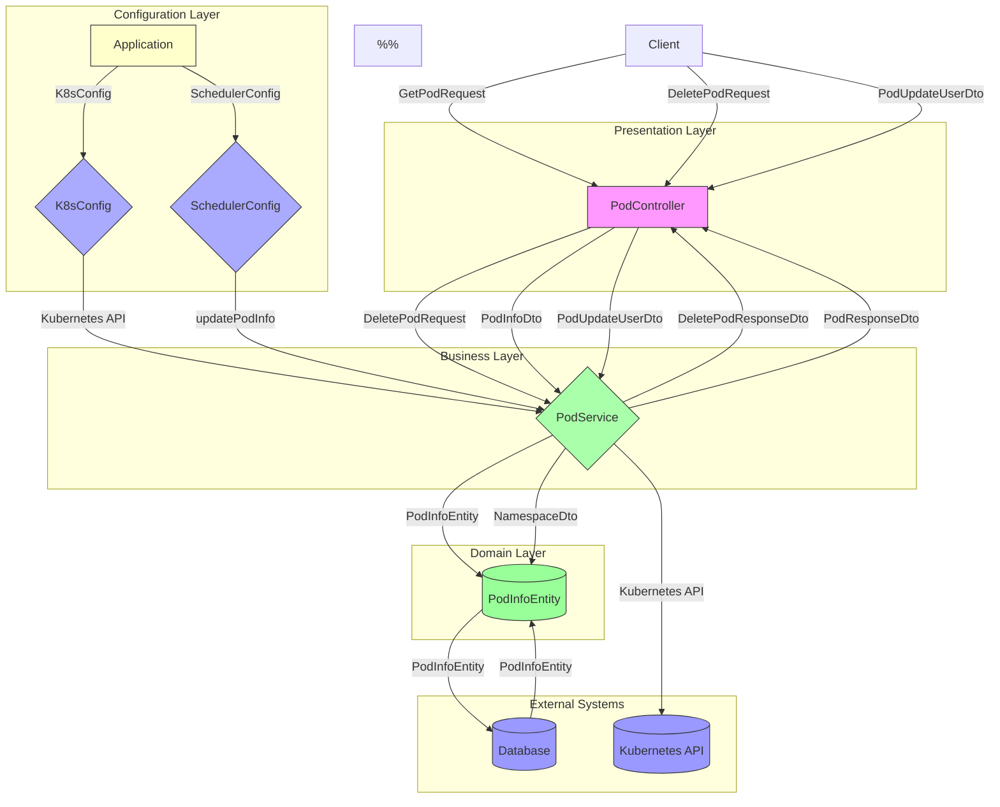
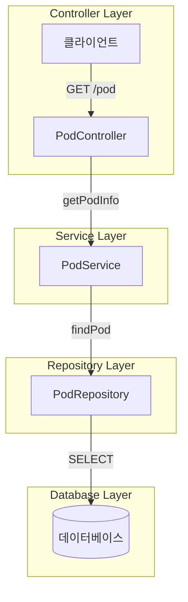
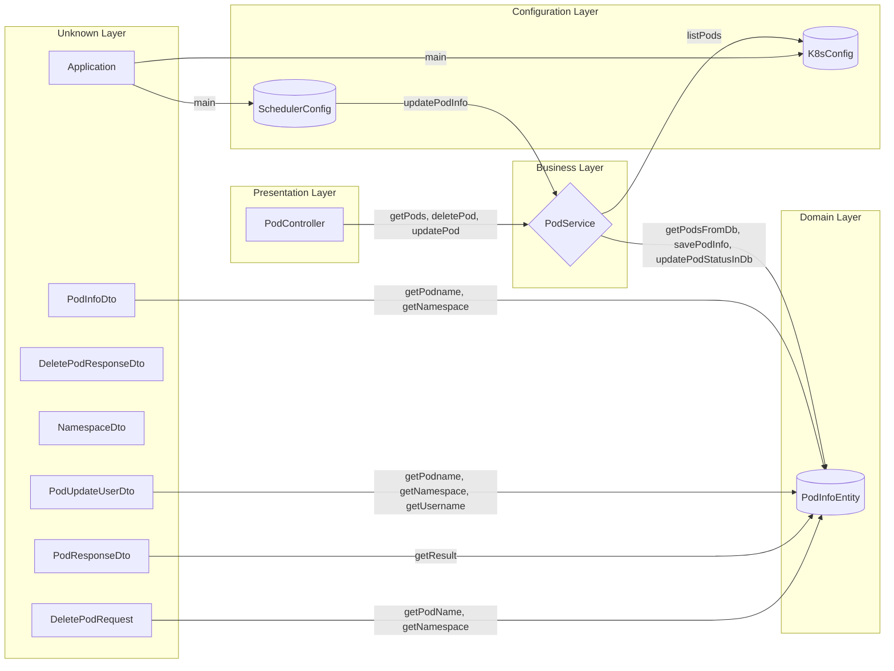
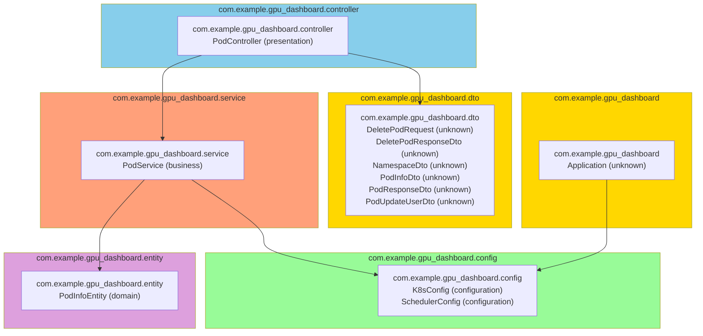
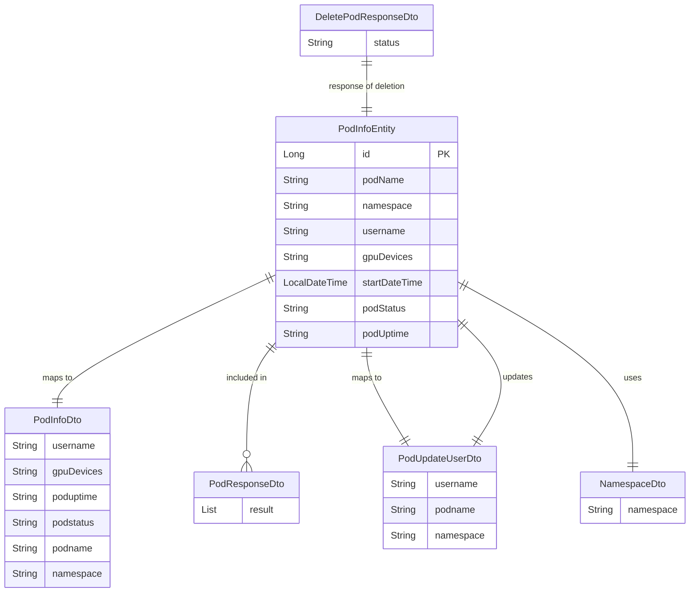

#  - Java 프로젝트 분석 리포트

**생성 시간**: 2025-05-28 16:00:17  
**분석 방식**: Bottom-up Comprehensive Analysis (LLM-Generated Diagrams)

## 📋 프로젝트 개요

- **프로젝트명**: 
- **아키텍처 패턴**: Multi-layered Architecture
- **도메인 영역**: entity, gpu_dashboard, controller, service, dto
- **기술 스택**: Java, Spring Boot, Spring Web MVC

### 📊 통계
- 전체 메서드: 49개
- 전체 클래스: 12개  
- 전체 패키지: 6개
- API 엔드포인트: 0개

## 🏗 시스템 아키텍처
> *LLM이 프로젝트 구조를 분석하여 자동 생성한 다이어그램입니다.*

## 🔄 API 흐름도
> *실제 프로젝트의 서비스 흐름을 바탕으로 LLM이 생성한 다이어그램입니다.*

## 🏢 서비스 계층 구조
> *계층별 클래스 분석 결과를 바탕으로 LLM이 생성한 아키텍처 다이어그램입니다.*

## 📦 패키지 의존성
> *패키지 간 의존성 관계를 LLM이 분석하여 시각화한 다이어그램입니다.*

## 🔗 도메인 모델 관계도
> *엔티티/도메인 클래스들의 관계를 LLM이 분석하여 생성한 클래스 다이어그램입니다.*

## 🌡️ 메서드 복잡도 분석
> *코드 복잡도가 높은 메서드들을 LLM이 시각화한 다이어그램입니다.*

```mermaid
graph TD
    subgraph com.example.gpu_dashboard.service.PodService
        listPods["listPods()<br/>복잡도: 11<br/>비즈니스 로직"]
        getPodsFromDb["getPodsFromDb()<br/>복잡도: 6<br/>데이터 조회"]
        savePodInfo["savePodInfo()<br/>복잡도: 6<br/>데이터 생성"]
        updatePodStatusInDb["updatePodStatusInDb()<br/>복잡도: 5<br/>데이터 수정"]
        updateUsername["updateUsername()<br/>복잡도: 4<br/>데이터 수정"]
    end

    subgraph com.example.gpu_dashboard.config.K8sConfig
        coreV1Api["coreV1Api()<br/>복잡도: 7<br/>비즈니스 로직"]
    end

    subgraph com.example.gpu_dashboard.config.SchedulerConfig
        updatePodInfo["updatePodInfo()<br/>복잡도: 6<br/>데이터 수정"]
    end

    subgraph com.example.gpu_dashboard.controller.PodController
        getPodsFromDbCtrl["getPodsFromDb()<br/>복잡도: 4<br/>데이터 조회"]
        deletePodCtrl["deletePod()<br/>복잡도: 3<br/>데이터 삭제"]
        getPodsCtrl["getPods()<br/>복잡도: 3<br/>데이터 조회"]
        updatePodCtrl["updatePod()<br/>복잡도: 1<br/>데이터 수정"]
    end

    subgraph com.example.gpu_dashboard.Application
        main["main()<br/>복잡도: 1<br/>비즈니스 로직"]
    end

    subgraph com.example.gpu_dashboard.dto.DeletePodRequest
        getNamespace["getNamespace()<br/>복잡도: 1<br/>데이터 조회"]
        getPodName["getPodName()<br/>복잡도: 1<br/>데이터 조회"]
        setNamespace["setNamespace()<br/>복잡도: 1<br/>비즈니스 로직"]
        setPodName["setPodName()<br/>복잡도: 1<br/>비즈니스 로직"]
    end

    subgraph com.example.gpu_dashboard.dto.DeletePodResponseDto
        getStatus["getStatus()<br/>복잡도: 1<br/>데이터 조회"]
    end

    subgraph com.example.gpu_dashboard.dto.NamespaceDto
        getNamespaceDto["getNamespace()<br/>복잡도: 1<br/>데이터 조회"]
        setNamespaceDto["setNamespace()<br/>복잡도: 1<br/>비즈니스 로직"]
    end

    style listPods fill:#e74c3c,stroke:#333
    style coreV1Api fill:#e74c3c,stroke:#333
    style updatePodInfo fill:#f1c40f,stroke:#333
    style getPodsFromDb fill:#f1c40f,stroke:#333
    style savePodInfo fill:#f1c40f,stroke:#333
    style getPodsFromDbCtrl fill:#f1c40f,stroke:#333
    style updatePodInfo fill:#f1c40f,stroke:#333
    style getPodsFromDbCtrl fill:#f1c40f,stroke:#333
    style deletePodCtrl fill:#2ecc71,stroke:#333
    style getPodsCtrl fill:#2ecc71,stroke:#333
    style updatePodCtrl fill:#2ecc71,stroke:#333
    style main fill:#2ecc71,stroke:#333
    style getNamespace fill:#2ecc71,stroke:#333
    style getPodName fill:#2ecc71,stroke:#333
    style setNamespace fill:#2ecc71,stroke:#333
    style setPodName fill:#2ecc71,stroke:#333
    style getStatus fill:#2ecc71,stroke:#333
    style getNamespaceDto fill:#2ecc71,stroke:#333
    style setNamespaceDto fill:#2ecc71,stroke:#333
```

## 📁 패키지 분석

### com.example.gpu_dashboard
- **목적**: 이 패키지는 GPU 대시보드 애플리케이션의 핵심 구성요소를 포함하며, `Application` 클래스를 통해 애플리케이션의 진입점과 기본 설정이 관리됩니다.  
패키지의 주요 역할은 GPU 상태 정보를 수집하고 시각화하는 애플리케이션의 실행 환경을 제공하는 것입니다.
- **도메인 영역**: gpu_dashboard
- **아키텍처 계층**: Unknown Layer
- **응집도**: 1.0
- **클래스 수**: 1개

### com.example.gpu_dashboard.config
- **목적**: 이 패키지는 GPU 대시보드 애플리케이션의 Kubernetes 및 스케줄링 관련 설정을 관리하는 역할을 합니다.  
`K8sConfig`는 Kubernetes 클러스터와의 연동을 위한 설정을 정의하고, `SchedulerConfig`는 작업 스케줄링과 관련된 구성 정보를 처리합니다.  
전체적으로 시스템의 구성 요소들이 올바르게 동작할 수 있도록 필요한 설정을 제공하는 configuration 계층입니다.
- **도메인 영역**: gpu_dashboard
- **아키텍처 계층**: Configuration Layer
- **응집도**: 1.0
- **클래스 수**: 2개

### com.example.gpu_dashboard.controller
- **목적**: 이 패키지는 GPU 대시보드 애플리케이션의 **presentation 계층**에 해당하며, 사용자 요청을 처리하고 응답을 반환하는 역할을 합니다.  
주요 클래스인 `PodController`는 **Pod 관련 HTTP 엔드포인트**를 제공하여 클라이언트와의 상호작용을 담당합니다.
- **도메인 영역**: controller
- **아키텍처 계층**: Presentation Layer
- **응집도**: 1.0
- **클래스 수**: 1개

### com.example.gpu_dashboard.dto
- **목적**: 이 패키지는 GPU 대시보드 애플리케이션에서 사용되는 데이터 전달 객체(DTO)를 정의하며, 주로 파드(Pod)와 네임스페이스(Namespace) 관련 요청/응답 데이터를 처리하는 데 활용됩니다. 클래스들은 클라이언트와 서버 간의 데이터 교환을 표준화하고, 삭제, 조회 등의 작업에 필요한 정보를 캡슐화합니다.
- **도메인 영역**: dto
- **아키텍처 계층**: Unknown Layer
- **응집도**: 1.0
- **클래스 수**: 6개

### com.example.gpu_dashboard.entity
- **목적**: 이 패키지는 GPU 대시보드 애플리케이션의 도메인 계층에서 사용되는 엔티티(Entity)를 정의합니다. 주요 클래스 `PodInfoEntity`는 Kubernetes Pod와 관련된 정보를 데이터베이스에 저장하고 관리하기 위한 모델 역할을 합니다.
- **도메인 영역**: entity
- **아키텍처 계층**: Domain Layer
- **응집도**: 1.0
- **클래스 수**: 1개

### com.example.gpu_dashboard.service
- **목적**: 이 패키지는 GPU 대시보드 애플리케이션의 비즈니스 로직을 처리하는 역할을 합니다. 주요 클래스인 `PodService`는 Pod 관련 데이터를 처리하고, GPU 사용 정보를 비즈니스 계층에서 관리하는 기능을 담당합니다.
- **도메인 영역**: service
- **아키텍처 계층**: Business Layer
- **응집도**: 1.0
- **클래스 수**: 1개

## 🔍 주요 인사이트

### 복잡도가 높은 메서드 Top 10
1. **listPods** (복잡도: 11) - com.example.gpu_dashboard.service.PodService [비즈니스 로직]
2. **coreV1Api** (복잡도: 7) - com.example.gpu_dashboard.config.K8sConfig [비즈니스 로직]
3. **updatePodInfo** (복잡도: 6) - com.example.gpu_dashboard.config.SchedulerConfig [데이터 수정]
4. **getPodsFromDb** (복잡도: 6) - com.example.gpu_dashboard.service.PodService [데이터 조회]
5. **savePodInfo** (복잡도: 6) - com.example.gpu_dashboard.service.PodService [데이터 생성]
6. **updatePodStatusInDb** (복잡도: 5) - com.example.gpu_dashboard.service.PodService [데이터 수정]
7. **getPodsFromDb** (복잡도: 4) - com.example.gpu_dashboard.controller.PodController [데이터 조회]
8. **updateUsername** (복잡도: 4) - com.example.gpu_dashboard.service.PodService [데이터 수정]
9. **deletePod** (복잡도: 3) - com.example.gpu_dashboard.controller.PodController [데이터 삭제]
10. **getPods** (복잡도: 3) - com.example.gpu_dashboard.controller.PodController [데이터 조회]

### 메서드가 많은 클래스 Top 10
1. **PodInfoEntity** (16개 메서드) - com.example.gpu_dashboard.entity [domain]
2. **PodInfoDto** (6개 메서드) - com.example.gpu_dashboard.dto [unknown]
3. **PodUpdateUserDto** (6개 메서드) - com.example.gpu_dashboard.dto [unknown]
4. **PodService** (6개 메서드) - com.example.gpu_dashboard.service [business]
5. **PodController** (4개 메서드) - com.example.gpu_dashboard.controller [presentation]
6. **DeletePodRequest** (4개 메서드) - com.example.gpu_dashboard.dto [unknown]
7. **NamespaceDto** (2개 메서드) - com.example.gpu_dashboard.dto [unknown]
8. **Application** (1개 메서드) - com.example.gpu_dashboard [unknown]
9. **K8sConfig** (1개 메서드) - com.example.gpu_dashboard.config [configuration]
10. **SchedulerConfig** (1개 메서드) - com.example.gpu_dashboard.config [configuration]

### 응집도가 높은 패키지 Top 5
1. **com.example.gpu_dashboard** (응집도: 1.0) - Unknown Layer [gpu_dashboard]
2. **com.example.gpu_dashboard.config** (응집도: 1.0) - Configuration Layer [gpu_dashboard]
3. **com.example.gpu_dashboard.controller** (응집도: 1.0) - Presentation Layer [controller]
4. **com.example.gpu_dashboard.dto** (응집도: 1.0) - Unknown Layer [dto]
5. **com.example.gpu_dashboard.entity** (응집도: 1.0) - Domain Layer [entity]

## 📈 분석 요약

이 리포트는  프로젝트에 대한 **LLM 기반 bottom-up 종합 분석** 결과입니다. 
메서드 레벨부터 시작하여 클래스, 패키지, 프로젝트 전체로 확장하면서 각 레벨에서의 
구조와 관계를 분석했습니다.

### 🤖 LLM 활용 시각화
모든 다이어그램은 분석된 프로젝트 데이터를 바탕으로 **OpenAI GPT 모델**이 자동 생성했습니다:
- 📊 시스템 아키텍처: 전체 구조와 계층 관계
- 🔄 API 흐름도: 요청 처리 흐름
- 🏢 서비스 계층: 계층별 클래스 구조
- 📦 패키지 의존성: 모듈 간 의존 관계
- 🔗 도메인 모델: 엔티티 관계
- 🌡️ 복잡도 분석: 코드 품질 시각화

### 📊 주요 특징
- **아키텍처 패턴**: Multi-layered Architecture
- **도메인 영역**: 5개 영역
- **코드 규모**: 12개 클래스, 49개 메서드
- **API 엔드포인트**: 0개

### 💡 권장사항
1. **복잡도 관리**: 상위 복잡도 메서드들의 리팩토링 검토
2. **아키텍처 일관성**: 계층별 역할 분리 점검
3. **패키지 구조**: 의존성 순환 검사 및 응집도 개선
4. **도메인 모델**: 엔티티 관계 명확화

이 분석을 통해 개발팀은 코드베이스의 구조를 더 잘 이해하고, 
향후 개발 및 리팩토링 계획을 수립할 수 있습니다.

---
*📝 이 리포트는 Java 프로젝트 자동 분석 도구로 생성되었으며, 모든 시각화는 LLM이 실시간으로 생성했습니다.*
